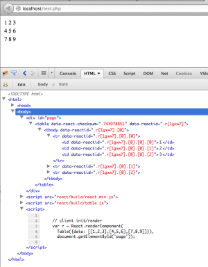
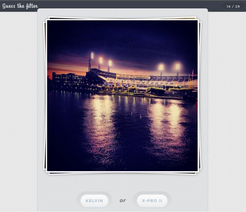

This is the 10th round-up already and React has come quite far since it was open sourced. Almost all new web projects at Khan Academy, Facebook, and Instagram are being developed using React. React has been deployed in a variety of contexts: a Chrome extension, a Windows 8 application, mobile websites, and desktop websites supporting Internet Explorer 8! Language-wise, React is not only being used within JavaScript but also CoffeeScript and ClojureScript.

The best part is that no drastic changes have been required to support all those use cases. Most of the efforts were targeted at polishing edge cases, performance improvements, and documentation.

## Khan Academy - Officially moving to React

[Joel Burget](http://joelburget.com/) announced at Hack Reactor that new front-end code at Khan Academy should be written in React!

> How did we get the rest of the team to adopt React? Using interns as an attack vector! Most full-time devs had already been working on their existing projects for a while and weren't looking to try something new at the time, but our class of summer interns was just arriving. For whatever reason, a lot of them decided to try React for their projects. Then mentors became exposed through code reviews or otherwise touching the new code. In this way React knowledge diffused to almost the whole team over the summer.
>
> Since the first React checkin on June 5, we've somehow managed to accumulate 23500 lines of jsx (React-flavored js) code. Which is terrifying in a way - that's a lot of code - but also really exciting that it was picked up so quickly.
>
> We held three meetings about how we should proceed with React. At the first two we decided to continue experimenting with React and deferred a final decision on whether to adopt it. At the third we adopted the policy that new code should be written in React.
>
> I'm excited that we were able to start nudging code quality forward. However, we still have a lot of work to do! One of the selling points of this transition is adopting a uniform frontend style. We're trying to upgrade all the code from (really old) pure jQuery and (regular old) Backbone views / Handlebars to shiny React. At the moment all we've done is introduce more fragmentation. We won't be gratuitously updating working code (if it ain't broke, don't fix it), but are seeking out parts of the codebase where we can shoot two birds with one stone by rewriting in React while fixing bugs or adding functionality.
>
> [Read the full article](http://joelburget.com/backbone-to-react/)


## React: Rethinking best practices

[Pete Hunt](http://www.petehunt.net/)'s talk at JSConf EU 2013 is now available in video.

<figure><iframe width="650" height="370" src="//www.youtube-nocookie.com/embed/x7cQ3mrcKaY" frameborder="0" allowfullscreen></iframe></figure>


## Server-side React with PHP

[Stoyan Stefanov](http://www.phpied.com/)'s series of articles on React has two new entries on how to execute React on the server to generate the initial page load.

> This post is an initial hack to have React components render server-side in PHP.
>
> - Problem: Build web UIs
> - Solution: React
> - Problem: UI built in JS is anti-SEO (assuming search engines are still noscript) and bad for perceived performance (blank page till JS arrives)
> - Solution: [React page](https://github.com/facebook/react-page) to render the first view
> - Problem: Can't host node.js apps / I have tons of PHP code
> - Solution: Use PHP then!
>
> [**Read part 1 ...**](http://www.phpied.com/server-side-react-with-php/)
>
> [**Read part 2 ...**](http://www.phpied.com/server-side-react-with-php-part-2/)
>
> Rendered markup on the server:
> <figure><a href="http://www.phpied.com/server-side-react-with-php-part-2/"></a></figure>


## TodoMVC Benchmarks

Webkit has a [TodoMVC Benchmark](https://github.com/WebKit/webkit/tree/master/PerformanceTests/DoYouEvenBench) that compares different frameworks. They recently included React and here are the results (average of 10 runs in Chrome 30):

- **AngularJS:** 4043ms
- **AngularJSPerf:** 3227ms
- **BackboneJS:** 1874ms
- **EmberJS:** 6822ms
- **jQuery:** 14628ms
- **React:** 2864ms
- **VanillaJS:** 5567ms

[Try it yourself!](http://www.petehunt.net/react/tastejs/benchmark.html)

Please don't take those numbers too seriously, they only reflect one very specific use case and are testing code that wasn't written with performance in mind.

Even though React scores as one of the fastest frameworks in the benchmark, the React code is simple and idiomatic. The only performance tweak used is the following function:

```javascript
/**
 * This is a completely optional performance enhancement that you can implement
 * on any React component. If you were to delete this method the app would still
 * work correctly (and still be very performant!), we just use it as an example
 * of how little code it takes to get an order of magnitude performance improvement.
 */
shouldComponentUpdate: function (nextProps, nextState) {
  return (
    nextProps.todo.id !== this.props.todo.id ||
    nextProps.todo !== this.props.todo ||
    nextProps.editing !== this.props.editing ||
    nextState.editText !== this.state.editText
  );
},
```

By default, React "re-renders" all the components when anything changes. This is usually fast enough that you don't need to care. However, you can provide a function that can tell whether there will be any change based on the previous and next states and props. If it is faster than re-rendering the component, then you get a performance improvement.

The fact that you can control when components are rendered is a very important characteristic of React as it gives you control over its performance. We are going to talk more about performance in the future, stay tuned.

## Guess the filter

[Connor McSheffrey](http://conr.me) implemented a small game using React. The goal is to guess which filter has been used to create the Instagram photo.
<figure><a href="http://guessthefilter.com/"></a></figure>


## React vs FruitMachine

[Andrew Betts](http://trib.tv/), director of the [Financial Times Labs](http://labs.ft.com/), posted an article comparing [FruitMachine](https://github.com/ftlabs/fruitmachine) and React.

> Eerily similar, no? Maybe Facebook was inspired by Fruit Machine (after all, we got there first), but more likely, it just shows that this is a pretty decent way to solve the problem, and great minds think alike. We're graduating to a third phase in the evolution of web best practice - from intermingling of markup, style and behaviour, through a phase in which those concerns became ever more separated and encapsulated, and finally to a model where we can do that separation at a component level. Developments like Web Components show the direction the web community is moving, and frameworks like React and Fruit Machine are in fact not a lot more than polyfills for that promised behaviour to come.
>
> [Read the full article...](http://labs.ft.com/2013/10/client-side-layout-engines-react-vs-fruitmachine/)

Even though we weren't inspired by FruitMachine (React has been used in production since before FruitMachine was open sourced), it's great to see similar technologies emerging and becoming popular.

## React Brunch

[Matthew McCray](http://elucidata.net/) implemented [react-brunch](https://npmjs.org/package/react-brunch), a JSX compilation step for [Brunch](http://brunch.io/).

> Adds React support to brunch by automatically compiling `*.jsx` files.
>
> You can configure react-brunch to automatically insert a react header (`/** @jsx React.DOM */`) into all `*.jsx` files. Disabled by default.
>
> Install the plugin via npm with `npm install --save react-brunch`.
>
> [Read more...](https://npmjs.org/package/react-brunch)

## Random Tweet

I'm going to start adding a tweet at the end of each round-up. We'll start with this one:

<blockquote class="twitter-tweet"><p>This weekend <a href="https://twitter.com/search?q=%23angular&amp;src=hash">#angular</a> died for me. Meet new king <a href="https://twitter.com/search?q=%23reactjs&amp;src=hash">#reactjs</a></p>&mdash; Eldar Djafarov &#x30C3; (@edjafarov) <a href="https://twitter.com/edjafarov/statuses/397033796710961152">November 3, 2013</a></blockquote>
