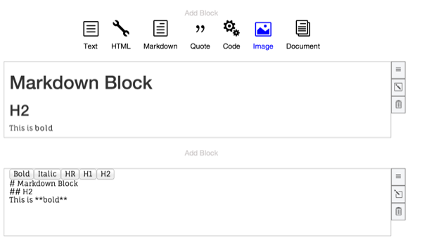
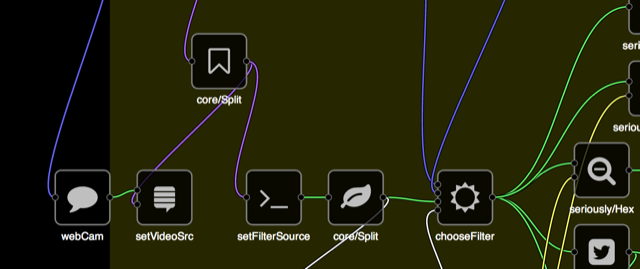

It's exciting to see the number of real-world React applications and components skyrocket over the past months! This community round-up features a few examples of inspiring React applications and components.

## React in the Real World

### Facebook Lookback video editor
Large parts of Facebook's web frontend are already powered by React. The recently released Facebook [Lookback video and its corresponding editor](https://www.facebook.com/lookback/edit/) are great examples of a complex, real-world React app.

### Russia's largest bank is now powered by React
Sberbank, Russia's largest bank, recently switched large parts of their site to use React, as detailed in [this post by Vyacheslav Slinko](https://groups.google.com/forum/#!topic/reactjs/Kj6WATX0atg).

### Relato
[Relato](https://bripkens.github.io/relato/) by [Ben Ripkens](https://github.com/bripkens) shows Open Source Statistics based on npm data. It features a filterable and sortable table built in React. Check it out &ndash; it's super fast!

### Makona Editor

 John Lynch ([@johnrlynch](https://twitter.com/johnrlynch)) created Makona, a block-style document editor for the web. Blocks of different content types comprise documents, authored using plain markup. At the switch of a toggle, block contents are then rendered on the page. While not quite a WYSIWYG editor, Makona uses plain textareas for input. This makes it compatible with a wider range of platforms than traditional rich text editors.

### Create Chrome extensions using React
React is in no way limited to just web pages. Brandon Tilley ([@BinaryMuse](https://twitter.com/BinaryMuse)) just released a detailed walk-through of [how he built his Chrome extension "Fast Tab Switcher" using React](http://brandontilley.com/2014/02/24/creating-chrome-extensions-with-react.html).

### Twitter Streaming Client

Javier Aguirre ([@javaguirre](https://twitter.com/javaguirre)) put together a simple [twitter streaming client using node, socket.io and React](http://javaguirre.net/2014/02/11/twitter-streaming-api-with-node-socket-io-and-reactjs/).

### Sproutsheet

[Sproutsheet](http://sproutsheet.com/) is a gardening calendar. You can use it to track certain events that happen in the life of your plants. It's currently in beta and supports localStorage, and data/image import and export.

### Instant Domain Search
[Instant Domain Search](https://instantdomainsearch.com/) also uses React. It sure is instant!

### SVG-based graphical node editor
[NoFlo](http://noflojs.org/) and [Meemoo](http://meemoo.org/) developer [Forresto Oliphant](http://www.forresto.com/) built an awesome SVG-based [node editor](https://forresto.github.io/prototyping/react/) in React.
 

### Ultimate Tic-Tac-Toe Game in React
Rafał Cieślak ([@Ravicious](https://twitter.com/Ravicious)) wrote a [React version](https://ravicious.github.io/ultimate-ttt/) of [Ultimate Tic Tac Toe](http://mathwithbaddrawings.com/2013/06/16/ultimate-tic-tac-toe/). Find the source [here](https://github.com/ravicious/ultimate-ttt).

### ReactJS Gallery

[Emanuele Rampichini](https://github.com/lele85)'s [ReactJS Gallery](https://github.com/lele85/ReactGallery) is a cool demo app that shows fullscreen images from a folder on the server. If the folder content changes, the gallery app updates via websockets.

Emanuele shared this awesome demo video with us:

<iframe width="650" height="315" src="//www.youtube-nocookie.com/embed/jYcpaemt90M" frameborder="0" allowfullscreen></iframe>

## React Components

### Table Sorter
[Table Sorter](https://bgerm.github.io/react-table-sorter-demo/) by [bgerm](https://github.com/bgerm) [[source](https://github.com/bgerm/react-table-sorter-demo)] is another helpful React component.

### Static-search

Dmitry Chestnykh [@dchest](https://twitter.com/dchest) wrote a [static search indexer](https://github.com/dchest/static-search) in Go, along with a [React-based web front-end](http://www.codingrobots.com/search/) that consumes search result via JSON.

### Lorem Ipsum component

[Martin Andert](https://github.com/martinandert) created [react-lorem-component](https://github.com/martinandert/react-lorem-component), a simple component for all your placeholding needs.

### Input with placeholder shim
[react-input=placeholder](https://github.com/enigma-io/react-input-placeholder) by [enigma-io](https://github.com/enigma-io) is a small wrapper around React.DOM.input that shims in placeholder functionality for browsers that don't natively support it.

### diContainer

[dicontainer](https://github.com/SpektrumFM/dicontainer) provides a dependency container that lets you inject Angular-style providers and services as simple React.js Mixins.

## React server rendering

Ever wonder how to pre-render React components on the server? [react-server-example](https://github.com/mhart/react-server-example) by Michael Hart ([@hichaelmart](https://twitter.com/hichaelmart)) walks through the necessary steps.

Similarly, Alan deLevie ([@adelevie](https://twitter.com/adelevie)) created [react-client-server-starter](https://github.com/adelevie/react-client-server-starter), another detailed walk-through of how to server-render your app.

## Random Tweet

<blockquote class="twitter-tweet" lang="en">
Recent changes: web ui is being upgraded to [#reactjs](https://twitter.com/search?q=%23reactjs&src=hash), HEAD~4 at [https://camlistore.googlesource.com/camlistore/](https://camlistore.googlesource.com/camlistore/)
&mdash; Camlistore (@Camlistore) <a href="https://twitter.com/Camlistore/status/423925795820539904">January 16, 2014</a></blockquote>

