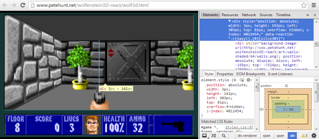

## React Meetups!
Ever wanted to find developers who also share the same interest in React than you? Recently, there has been a React Meetup in [San Francisco](http://www.meetup.com/ReactJS-San-Francisco/) (courtesy of [Telmate](http://www.telmate.com)), and one in [London](http://www.meetup.com/London-React-User-Group/) (courtesy of [Stuart Harris](http://www.meetup.com/London-React-User-Group/members/105837542/), [Cain Ullah](http://www.meetup.com/London-React-User-Group/members/15509971/) and [Zoe Merchant](http://www.meetup.com/London-React-User-Group/members/137058242/)). These two events have been big successes; a second one in London is [already planned](http://www.meetup.com/London-React-User-Group/events/191406572/).

If you don't live near San Francisco or London, why not start one in your community?

## Complementary Tools
In case you haven't seen it, we've consolidated the tooling solution around React on [this wiki page](https://github.com/facebook/react/wiki/Complementary-Tools). Some of the notable recent entries include:

- [Ryan Florence](https://github.com/rpflorence) and [Michael Jackson](https://github.com/mjackson)'s [react-nested-router](https://github.com/rpflorence/react-nested-router), which is a translation of the Ember router API to React.

- [Stephen J. Collings](https://github.com/stevoland)'s [react-bootstrap](https://github.com/react-bootstrap/react-bootstrap), which wraps the popular framework with a bit of React goodness. The [website](https://react-bootstrap.github.io/components.html) features live-editable demos.

- [Andrey Popp](https://github.com/andreypopp)'s [react-quickstart](https://github.com/andreypopp/react-quickstart), which gives you a quick template for server-side rendering and routing, among other features.

These are some of the links that often pop up on the #reactjs IRC channel. If you made something that you think deserves to be shown on the wiki, feel free to add it!

## React in Interesting Places

The core concepts React themselves is something very valuable that the community is exploring and pushing further. A year ago, we wouldn't have imagined something like [Bruce Hauman](http://rigsomelight.com)'s [Flappy Bird ClojureScript port](http://rigsomelight.com/2014/05/01/interactive-programming-flappy-bird-clojurescript.html), whose interactive programming has been made possible through React:

<iframe width="650" height="315" src="//www.youtube-nocookie.com/embed/KZjFVdU8VLI" frameborder="0" allowfullscreen></iframe>

And don't forget [Pete Hunt](https://github.com/petehunt)'s Wolfenstein 3D rendering engine in React ([source code](https://github.com/petehunt/wolfenstein3D-react/blob/master/js/renderer.js#L183)). While it's nearly a year old, it's still a nice demo.

Give us a shoutout on IRC or [React Google Groups](https://groups.google.com/forum/#!forum/reactjs) if you've used React in some Interesting places.

## Even More People Using React

### Prismatic
[Prismatic](http://getprismatic.com/home) recently shrank their codebase fivefold with the help of React and its popular ClojureScript wrapper, [Om](https://github.com/swannodette/om). They detailed their very positive experience [here](http://blog.getprismatic.com/om-sweet-om-high-functional-frontend-engineering-with-clojurescript-and-react/).

> Finally, the state is normalized: each piece of information is represented in a single place. Since React ensures consistency between the DOM and the application data, the programmer can focus on ensuring that the state properly stays up to date in response to user input. If the application state is normalized, then this consistency is guaranteed by definition, completely avoiding the possibility of an entire class of common bugs.

### Adobe Brackets
[Kevin Dangoor](http://www.kevindangoor.com) works on [Brackets](http://brackets.io/?lang=en), the open-source code editor. After writing [his first impression on React](http://www.kevindangoor.com/2014/05/simplifying-code-with-react/), he followed up with another insightful [article](http://www.kevindangoor.com/2014/05/react-in-brackets/) on how to gradually make the code transition, how to preserve the editor's good parts, and how to tune Brackets' tooling around JSX.

> We don’t need to switch to React everywhere, all at once. It’s not a framework that imposes anything on the application structure. [...] Easy, iterative adoption is definitely something in React’s favor for us.

### Storehouse
[Storehouse](https://www.storehouse.co) (Apple Design Award 2014)'s web presence is build with React. Here's [an example story](https://www.storehouse.co/stories/y2ad-mexico-city-clouds). Congratulations on the award!

### Vim Awesome
[Vim Awesome](http://vimawesome.com), an open-source Vim plugins directory built on React, was just launched. Be sure to [check out the source code](https://github.com/divad12/vim-awesome) if you're curious to see an example of how to build a small single-page React app.

## Random Tweets

<blockquote class="twitter-tweet" lang="en">
Spent 12 hours so far with <a href="https://twitter.com/hashtag/reactjs?src=hash">#reactjs</a>. Spent another 2 wondering why we&#39;ve been doing JS frameworks wrong until now. React makes me happy.
&mdash; Paul Irwin (@paulirwin) <a href="https://twitter.com/paulirwin/statuses/481263947589242882">June 24, 2014</a></blockquote>
