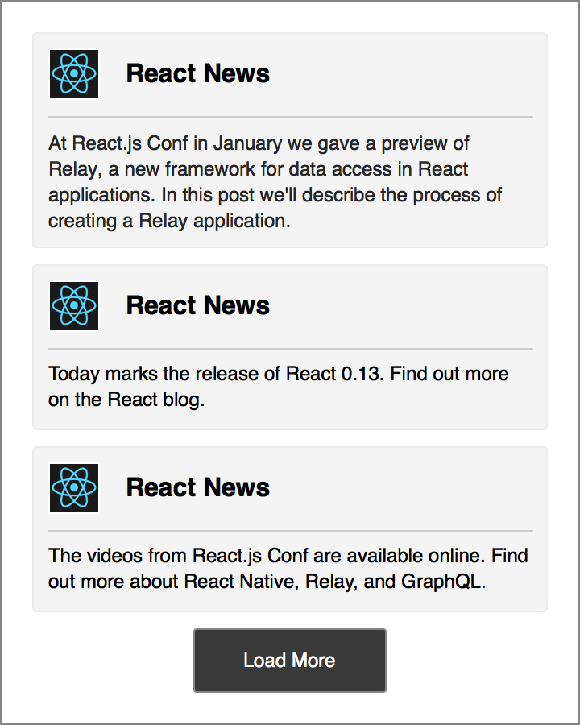
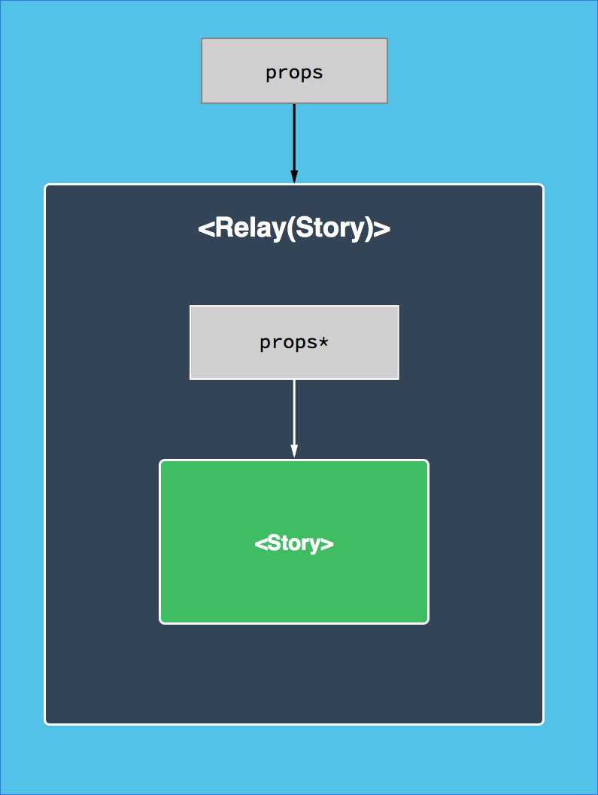
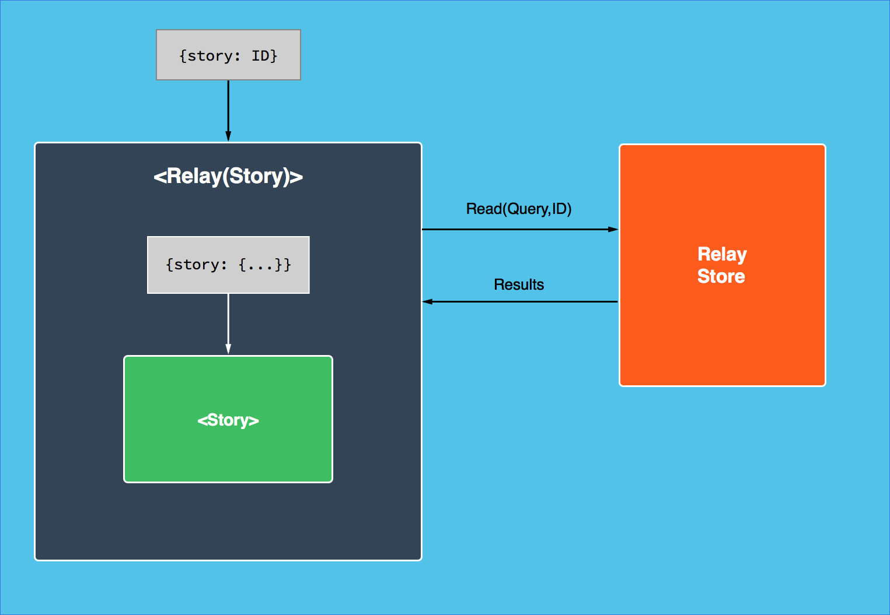

At React.js Conf in January we gave a preview of Relay, a new framework for building data-driven applications in React. In this post, we'll describe the process of creating a Relay application. This post assumes some familiarity with the concepts of Relay and GraphQL, so if you haven't already we recommend reading [our introductory blog post](/blog/2015/02/20/introducing-relay-and-graphql.html) or watching [the conference talk](https://www.youtube-nocookie.com/v/9sc8Pyc51uU).

We're working hard to prepare GraphQL and Relay for public release. In the meantime, we'll continue to provide information about what you can expect.

<br/>

## The Relay Architecture

The diagram below shows the main parts of the Relay architecture on the client and the server:


The main pieces are as follows:

- Relay Components: React components annotated with declarative data descriptions.
- Actions: Descriptions of how data should change in response to user actions.
- Relay Store: A client-side data store that is fully managed by the framework.
- Server: An HTTP server with GraphQL endpoints (one for reads, one for writes) that respond to GraphQL queries.

This post will focus on **Relay components** that describe encapsulated units of UI and their data dependencies. These components form the majority of a Relay application.

<br/>

## A Relay Application

To see how components work and can be composed, let's implement a basic version of the Facebook News Feed in Relay. Our application will have two components: a `<NewsFeed>` that renders a list of `<Story>` items. We'll introduce the plain React version of each component first and then convert it to a Relay component. The goal is something like the following:



<br/>

## The `<Story>` Begins

The first step is a React `<Story>` component that accepts a `story` prop with the story's text and author information. Note that all examples uses ES6 syntax and elide presentation details to focus on the pattern of data access.

```javascript
// Story.react.js
export default class Story extends React.Component {
  render() {
    var story = this.props.story;
    return (
      <View>
        <Image uri={story.author.profilePicture.uri} />
        <Text>{story.author.name}</Text>
        <Text>{story.text}</Text>
      </View>
    );
  }
}
```

<br/>

## What's the `<Story>`?

Relay automates the process of fetching data for components by wrapping existing React components in Relay containers (themselves React components):

```javascript
// Story.react.js
class Story extends React.Component { ... }

export default Relay.createContainer(Story, {
  fragments: {
    story: /* TODO */
  }
});
```

Before adding the GraphQL fragment, let's look at the component hierarchy this creates:



Most props will be passed through from the container to the original component. However, Relay will return the query results for a prop whenever a fragment is defined. In this case we'll add a GraphQL fragment for `story`:

```javascript
// Story.react.js
class Story extends React.Component { ... }

export default Relay.createContainer(Story, {
  fragments: {
    story: () => Relay.QL`
      fragment on Story {
        author {
          name
          profilePicture {
            uri
          }
        }
        text
      }
    `,
  },
});
```

Queries use ES6 template literals tagged with the `Relay.QL` function. Similar to how JSX transpiles to plain JavaScript objects and function calls, these template literals transpile to plain objects that describe fragments. Note that the fragment's structure closely matches the object structure that we expected in `<Story>`'s render function.

<br/>

## `<Story>`s on Demand

We can render a Relay component by providing Relay with the component (`<Story>`) and the ID of the data (a story ID). Given this information, Relay will first fetch the results of the query and then `render()` the component. The value of `props.story` will be a plain JavaScript object such as the following:

```javascript
{
  author: {
    name: "Greg",
    profilePicture: {
      uri: "https://…"
    }
  },
  text: "The first Relay blog post is up…"
}
```

Relay guarantees that all data required to render a component will be available before it is rendered. This means that `<Story>` does not need to handle a loading state; the `story` is *guaranteed* to be available before `render()` is called. We have found that this invariant simplifies our application code *and* improves the user experience. Of course, Relay also has options to delay the fetching of some parts of our queries.

The diagram below shows how Relay containers make data available to our React components:



<br/>

## `<NewsFeed>` Worthy

Now that the `<Story>` is over we can continue with the `<NewsFeed>` component. Again, we'll start with a React version:

```javascript
// NewsFeed.react.js
class NewsFeed extends React.Component {
  render() {
    var stories = this.props.viewer.stories; // `viewer` is the active user
    return (
      <View>
        {stories.map(story => <Story story={story} />)}
        <Button onClick={() => this.loadMore()}>Load More</Button>
      </View>
    );
  }

  loadMore() {
    // TODO: fetch more stories
  }
}

module.exports = NewsFeed;
```

<br/>

## All the News Fit to be Relayed

`<NewsFeed>` has two new requirements: it composes `<Story>` and requests more data at runtime.

Just as React views can be nested, Relay components can compose query fragments from child components. Composition in GraphQL uses ES6 template literal substitution: `${Component.getFragment('prop')}`. Pagination can be accomplished with a variable, specified with `$variable` (as in `stories(first: $count)`):

```javascript
// NewsFeed.react.js
class NewsFeed extends React.Component { ... }

export default Relay.createContainer(NewsFeed, {
  initialVariables: {
    count: 3                                /* default to 3 stories */
  },
  fragments: {
    viewer: () => Relay.QL`
      fragment on Viewer {
        stories(first: $count) {            /* fetch viewer's stories */
          edges {                           /* traverse the graph */
            node {
              ${Story.getFragment('story')} /* compose child fragment */
            }
          }
        }
      }
    `,
  },
});
```

Whenever `<NewsFeed>` is rendered, Relay will recursively expand all the composed fragments and fetch the queries in a single trip to the server. In this case, the `text` and `author` data will be fetched for each of the 3 story nodes.

Query variables are available to components as `props.relay.variables` and can be modified with `props.relay.setVariables(nextVariables)`. We can use these to implement pagination:

```javascript
// NewsFeed.react.js
class NewsFeed extends React.Component {
  render() { ... }

  loadMore() {
    // read current params
    var count = this.props.relay.variables.count;
    // update params
    this.props.relay.setVariables({
      count: count + 5,
    });
  }
}
```

Now when `loadMore()` is called, Relay will send a GraphQL request for the additional five stories. When these stories are fetched, the component will re-render with the new stories available in `props.viewer.stories` and the updated count reflected in `props.relay.variables.count`.

<br/>

## In Conclusion

These two components form a solid core for our application. With the use of Relay containers and GraphQL queries, we've enabled the following benefits:

- Automatic and efficient pre-fetching of data for an entire view hierarchy in a single network request.
- Trivial pagination with automatic optimizations to fetch only the additional items.
- View composition and reusability, so that `<Story>` can be used on its own or within `<NewsFeed>`, without any changes to either component.
- Automatic subscriptions, so that components will re-render if their data changes. Unaffected components will not re-render unnecessarily.
- Exactly *zero* lines of imperative data fetching logic. Relay takes full advantage of React's declarative component model.

But Relay has many more tricks up its sleeve. For example, it's built from the start to handle reads and writes, allowing for features like optimistic client updates with transactional rollback. Relay can also defer fetching select parts of queries, and it uses a local data store to avoid fetching the same data twice. These are all powerful features that we hope to explore in future posts.
