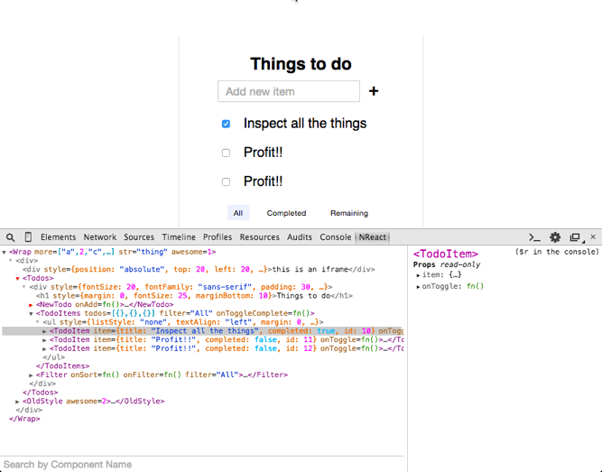
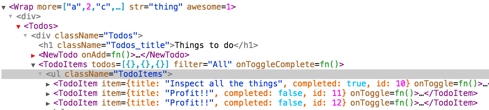
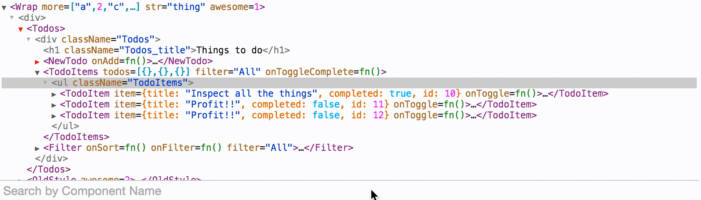
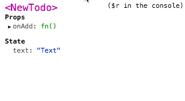

We've made an entirely new version of the devtools, and we want you to try it
out!

## Why entirely new?

Perhaps the biggest reason was to create a defined API for dealing with
internals, so that other tools could benefit as well and not have to depend on
implementation details. This gives us more freedom to refactor things
internally without worrying about breaking tooling.

The current version of the devtools is a fork of Blink's "Elements" pane, and
is imperative, mutation-driven, and tightly integrated with Chrome-specific
APIs. The new devtools are much less coupled to Chrome, and easier to reason
about thanks to React.

## What are the benefits?

- 100% React
- Firefox compatible
- React Native compatible
- more extensible & hackable

## Are there any new features?

Yeah!

### The Tree View

- Much richer view of your props, including the contents of objects and arrays
- Custom components are emphasized, native components are de-emphasized
- Stateful components have a red collapser
- Improved keyboard navigation (hjkl or arrow keys)
- Selected component is available in the console as `$r`
- Props that change highlight in green
- Right-click menu

  - Scroll node into view
  - Show the source for a component in the "Sources" pane
  - Show the element in the "Elements" pane

### Searching

Select the search bar (or press "/"), and start searching for a component by
name.

### The Side Pane

- Now shows the `context` for a component
- Right-click to store a prop/state value as a global variable

## How do I install it?

First, disable the Chrome web store version, or it will break things. Then
[download the .crx](https://github.com/facebook/react-devtools/releases) and
drag it into your `chrome://extensions` page. If it's not working to drag it
from the downloads bar, try opening your downloads folder and drag it from
there.

Once we've determined that there aren't any major regressions, we'll update
the official web store version, and everyone will be automatically upgraded.

### Also Firefox!

We also have an initial version of the devtools for Firefox, which you can
download from the same [release page](https://github.com/facebook/react-devtools/releases).

## Feedback welcome

Let us know what issues you run into
[on GitHub](https://github.com/facebook/react-devtools/issues), and check out
[the README](https://github.com/facebook/react-devtools/tree/devtools-next)
for more info.

## Update
*August 12, 2015*

A second beta is out, with a number of bugfixes. It is also listed on the
[releases page](https://github.com/facebook/react-devtools/releases).
