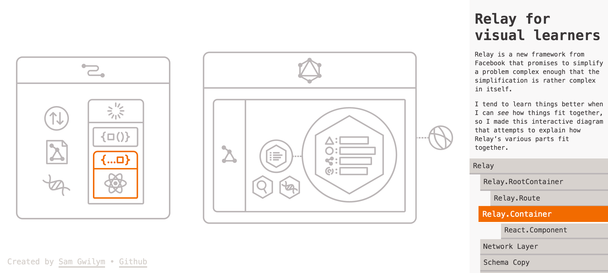

In the weeks following the [open-source release](/blog/2015/08/11/relay-technical-preview.html) of the Relay technical preview, the community has been abuzz with activity. We are honored to have been able to enjoy a steady stream of ideas and contributions from such a talented group of individuals. Let's take a look at some of the things we've achieved, together!

## Teaching servers to speak GraphQL

Every great Relay app starts by finding a GraphQL server to talk to. The community has spent the past few weeks teaching GraphQL to a few backend systems.

Bryan Goldstein ([brysgo](https://github.com/brysgo)) has built a tool to help you define a GraphQL schema that wraps a set of [Bookshelf.JS](http://bookshelfjs.org/) models. Check out [graphql-bookshelf](https://github.com/brysgo/graphql-bookshelf).

RisingStack ([risingstack](https://github.com/risingstack)) created a GraphQL ORM called [graffiti](https://github.com/RisingStack/graffiti) that you can plug into [mongoose](http://mongoosejs.com/) and serve using Express, Hapi, or Koa.

David Mongeau-Petitpas ([dmongeau](https://github.com/dmongeau)) is working on a way to vend your Laravel models through a GraphQL endpoint, [laravel-graphql](https://github.com/Folkloreatelier/laravel-graphql).

Gerald Monaco ([devknoll](https://github.com/devknoll)) created [graphql-schema](https://github.com/devknoll/graphql-schema) to allow the creation of JavaScript GraphQL schemas using a fluent/chainable interface.

Jason Dusek ([solidsnack](https://github.com/solidsnack)) dove deep into PostgreSQL to teach it how to respond to GraphQL query strings as though they were SQL queries. Check out [GraphpostgresQL](https://github.com/solidsnack/GraphpostgresQL).

Espen Hovlandsdal ([rexxars](https://github.com/rexxars)) built a [sql-to-graphql](https://github.com/vaffel/sql-to-graphql) tool that can perform introspection on the tables of a MySQL or PostgreSQL database, and produce a queryable HTTP GraphQL endpoint out of it.

Mick Hansen ([mickhansen](https://github.com/mickhansen)) offers a set of [schema-building helpers](https://github.com/mickhansen/graphql-sequelize) for use with the [Sequelize ORM](http://docs.sequelizejs.com/en/latest/) for MySQL, PostgreSQL, SQLite, and MSSQL.

## GraphQL beyond JavaScript

Robert Mosolgo ([rmosolgo](https://github.com/rmosolgo)) brought the full set of schema-building and query execution tools to Ruby, in the form of [graphql-ruby](https://github.com/rmosolgo/graphql-ruby) and [graphql-relay-ruby](https://github.com/rmosolgo/graphql-relay-ruby). Check out his [Rails-based demo](https://github.com/rmosolgo/graphql-ruby-demo).

Andreas Marek ([andimarek](https://github.com/andimarek)) has brewed up a Java implementation of GraphQL, [graphql-java](https://github.com/andimarek/graphql-java).

[vladar](https://github.com/vladar) is hard at work on a PHP port of the GraphQL reference implementation, [graphql-php](https://github.com/webonyx/graphql-php).

Taeho Kim ([dittos](https://github.com/dittos)) is bringing GraphQL to Python, with [graphql-py](https://github.com/dittos/graphql-py).

Oleg Ilyenko ([OlegIlyenko](https://github.com/OlegIlyenko)) made a beautiful and [delicious-looking website](http://sangria-graphql.org/) for a Scala implementation of GraphQL, [sangria](https://github.com/sangria-graphql/sangria).

Joe McBride ([joemcbride](https://github.com/joemcbride)) has an up-and-running example of GraphQL for .NET, [graphql-dotnet](https://github.com/joemcbride/graphql-dotnet).

## Show me, don't tell me

Interact with this [visual tour of Relay's architecture](http://sgwilym.github.io/relay-visual-learners/) by Sam Gwilym ([sgwilym](https://github.com/sgwilym)).

Sam has already launched a product that leverages Relay's data-fetching, optimistic responses, pagination, and mutations &ndash; all atop a Ruby GraphQL server: [new.comique.co](http://new.comique.co/)

## Prototyping in the browser

I ([steveluscher](https://github.com/steveluscher)) whipped up [a prototyping tool](https://facebook.github.io/relay/prototyping/playground.html) that you can use to hack on a schema and a React/Relay app, from the comfort of your browser. Thanks to Jimmy Jia ([taion](https://github.com/taion)) for supplying the local-only network layer, [relay-local-schema](https://github.com/relay-tools/relay-local-schema).

## Skeletons in the closet

Joseph Rollins ([fortruce](https://github.com/fortruce)) created a hot-reloading, auto schema-regenerating, [Relay skeleton](https://github.com/fortruce/relay-skeleton) that you can use to get up and running quickly.

Michael Hart ([mhart](https://mhart)) built a [simple-relay-starter](https://github.com/mhart/simple-relay-starter) kit using Browserify.

## Routing around

Jimmy Jia ([taion](https://github.com/taion)) and Gerald Monaco ([devknoll](https://github.com/devknoll)) have been helping lost URLs find their way to Relay apps through their work on [react-router-relay](https://github.com/relay-tools/react-router-relay). Check out Christoph Pojer's ([cpojer](https://github.com/cpojer)) [blog post](https://medium.com/@cpojer/relay-and-routing-36b5439bad9) on the topic. Jimmy completed the Relay TodoMVC example with routing, which you can check out at [taion/relay-todomvc](https://github.com/taion/relay-todomvc).

Chen Hung-Tu ([transedward](https://github.com/transedward)) built a chat app atop the above mentioned router, with threaded conversations and pagination. Check it out at [transedward/relay-chat](https://github.com/transedward/relay-chat).

## In your words

  

    <blockquote class="twitter-tweet" lang="en">
Relay making good on its promise to be the &quot;React.js of data fetching&quot;. Rebuilding small app with it. Spectacular how fast/easy building is.
&mdash; Kyle Mathews (@kylemathews) <a href="https://twitter.com/kylemathews/status/640289107122368513">September 5, 2015</a></blockquote>

    <blockquote class="twitter-tweet" lang="en">
<a href="https://twitter.com/hashtag/RainySundayHackathon?src=hash">#RainySundayHackathon</a> exploring <a href="https://twitter.com/hashtag/GraphQL?src=hash">#GraphQL</a> <a href="https://twitter.com/hashtag/RelayJS?src=hash">#RelayJS</a> <a href="http://t.co/Mm3HlqMejJ">pic.twitter.com/Mm3HlqMejJ</a>
&mdash; Bastian Kistner (@passionkind) <a href="https://twitter.com/passionkind/status/632846601447411712">August 16, 2015</a></blockquote>

    <blockquote class="twitter-tweet" lang="en">
Friday. Time to GraphQL a MySQL database. <a href="https://twitter.com/hashtag/graphql?src=hash">#graphql</a> <a href="https://twitter.com/hashtag/relayjs?src=hash">#relayjs</a> <a href="https://twitter.com/hashtag/reactjs?src=hash">#reactjs</a> <a href="https://twitter.com/hashtag/webapp?src=hash">#webapp</a>
&mdash; xador (@xadorfr) <a href="https://twitter.com/xadorfr/status/632108552765751296">August 14, 2015</a></blockquote>
  

  

    <blockquote class="twitter-tweet" lang="en">
Started a new <a href="https://twitter.com/hashtag/RelayJS?src=hash">#RelayJS</a> and <a href="https://twitter.com/hashtag/GraphQL?src=hash">#GraphQL</a> meet up group! <a href="http://t.co/Vt6Cv4nNH4">http://t.co/Vt6Cv4nNH4</a> If you&#39;re in the Bay Area, I&#39;d love to have you join! <a href="https://twitter.com/hashtag/ReactJS?src=hash">#ReactJS</a>
&mdash; Gerald Monaco (@devknoll) <a href="https://twitter.com/devknoll/status/636723716123000832">August 27, 2015</a></blockquote>

    <blockquote class="twitter-tweet" lang="en">
.<a href="https://twitter.com/reactjs">@reactjs</a> <a href="https://twitter.com/laneykuenzel">@laneykuenzel</a> <a href="https://twitter.com/BhuwanKhattar">@BhuwanKhattar</a> these <a href="https://twitter.com/hashtag/relayjs?src=hash">#relayjs</a> mutations. they&#39;re mind-blowingly awesome. they make so much damn sense. thank you!
&mdash; Jimmy Jia (@jimmy_jia) <a href="https://twitter.com/jimmy_jia/status/634204563709526016">August 20, 2015</a></blockquote>

    <blockquote class="twitter-tweet" lang="en">
REST is dead, long live REST! <a href="https://twitter.com/hashtag/graphql?src=hash">#graphql</a> <a href="https://twitter.com/hashtag/relayjs?src=hash">#relayjs</a>
&mdash; Syrus Akbary (@syrusakbary) <a href="https://twitter.com/syrusakbary/status/631531666113060864">August 12, 2015</a></blockquote>
  

