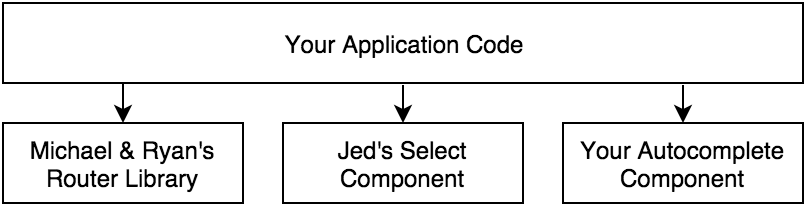
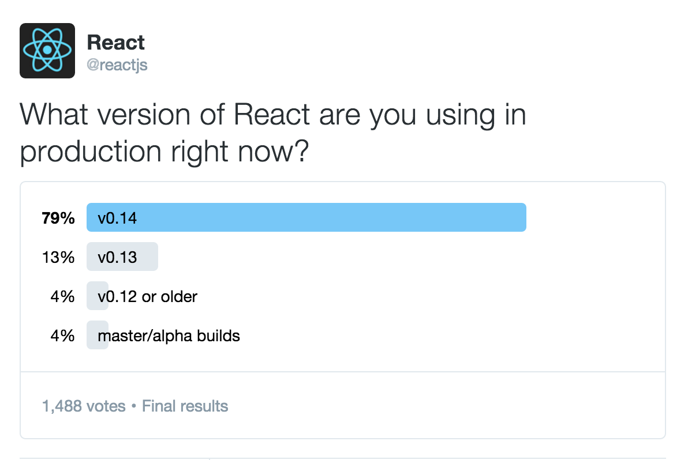
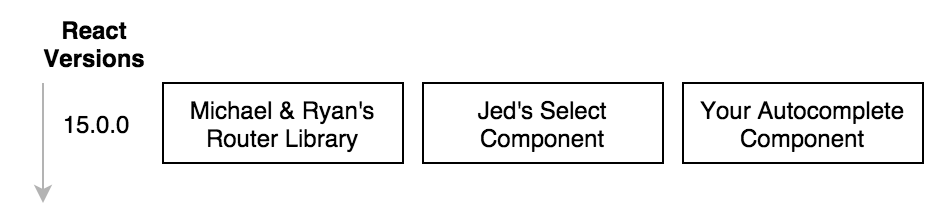
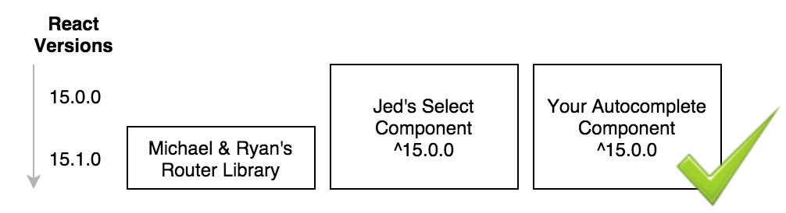
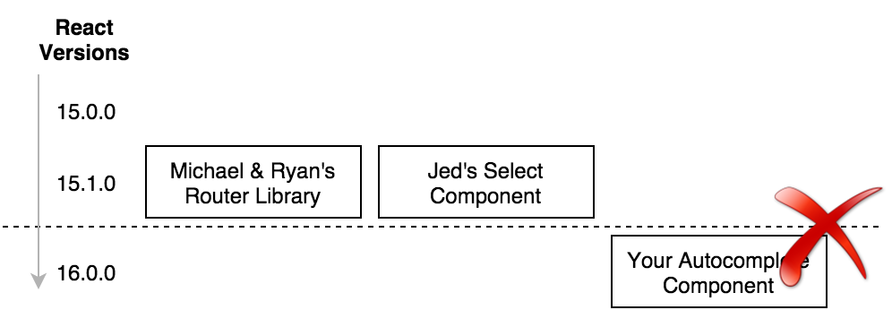
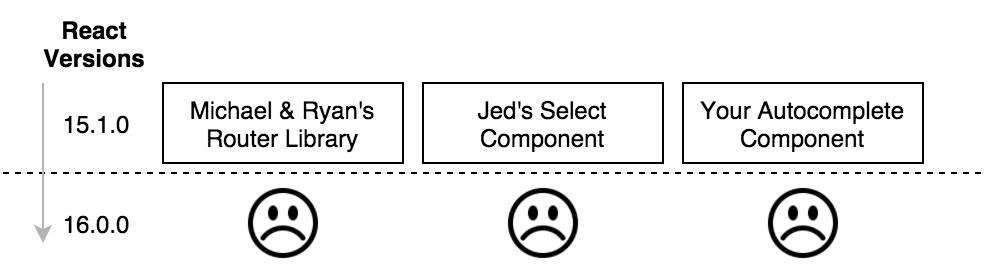
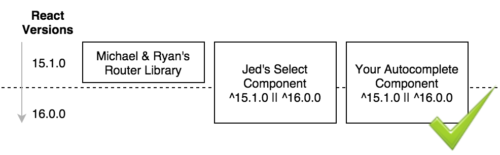

Today we're announcing that we're switching to major revisions for React. The current version is 0.14.7. The next release will be: **15.0.0**

This change shouldn't materially affect most of you. Moving to major semver versions simply helps indicate our commitment to stability and gives us the flexibility to add new backwards-compatible features in minor releases. This means we can have fewer major releases and you won't have to wait as long to take advantage of improvements to React. Plus, if you're a component author, this versioning scheme gives you the flexibility to support two major versions of React at the same time so you don't need to leave anyone behind.

The core of the React API has been stable for years. Our business as well as many of yours all depend heavily on the use of React as a core piece of our infrastructure. We're committed to the stability as well as the progress of React going forward.

## Bring Everyone Along

React isn't just a library but an ecosystem. We know that your applications and ours are not just isolated islands of code. It is a network of your own application code, your own open source components and third party libraries that all depend on React.

Therefore it is important that we don't just upgrade our own codebases but that we bring our whole community with us. We take the upgrade path very seriously - for everyone.

## Introducing Minor Releases

Ideally everyone could just depend on the latest version of React all the time.

We know that in practice that is not possible. In the future, we expect more new additive APIs rather than breakage of existing ones. By moving to major revisions in the semver scheme, we can release new versions without breaking existing ones.

That means that if one component needs a new API, there is no need for any of the other components to do any further work. They remain compatible.

## What Happened to 1.0.0?

Part of React's growth and popularity is that it is stable and performant in production. People have long asked what React v1.0 will look. Technically some breaking changes are important to avoid stagnating, but we still achieve stability by making it easy to upgrade. If major version numbers indicate API stability and engender trust that it can be used in production, then we got there a long time ago. There are too many preconceived notions of what v1.0 is. We're still following semver. We're just communicating stability by moving the 0 from the beginning to the end.

## Breaking Changes

Minor revision releases will include deprecation warnings and tips for how to upgrade an API or pattern that will be removed or changed in the future.

We will continue to release [codemods](https://www.youtube.com/watch?v=d0pOgY8__JM) for common patterns to make automatic upgrades of your codebase easier.

Once we've reached the end of life for a particular major version, we'll release a new major version where all deprecated APIs have been removed.

## Avoiding The Major Cliff

If you try to upgrade your component to 16.0.0 you might find that your application no longer works if you still have other dependencies. E.g. if Ryan's and Jed's components are only compatible with 15.x.x.

Worst case, you revert back to 15.1.0 for your application. Since you'll want to use your component, you might also revert that one.

Of course, Ryan and Jed think the same way. If we're not careful, we can hit a cliff where nobody upgrades. This has happened to many software project ecosystems in the past.

Therefore, we're committed to making it easy for most components and libraries built on top of React to be compatible with two major versions at the same time. We will do this by introducing new APIs before completely removing the old ones, thereby avoiding those cliffs.

