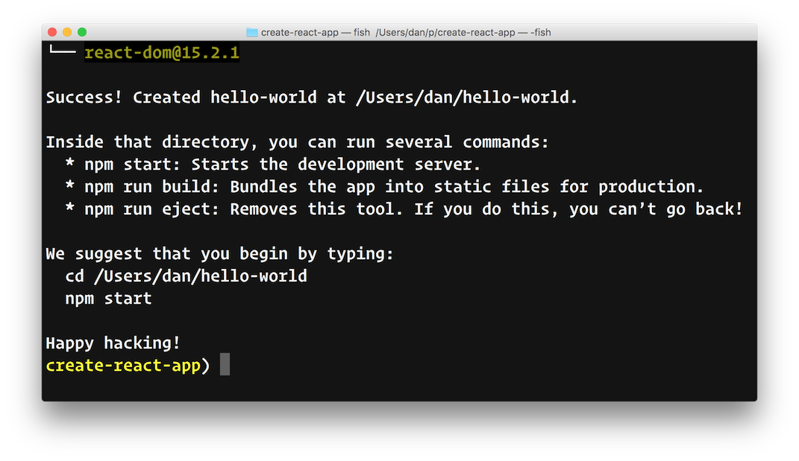
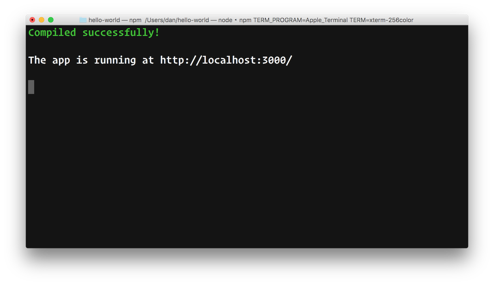
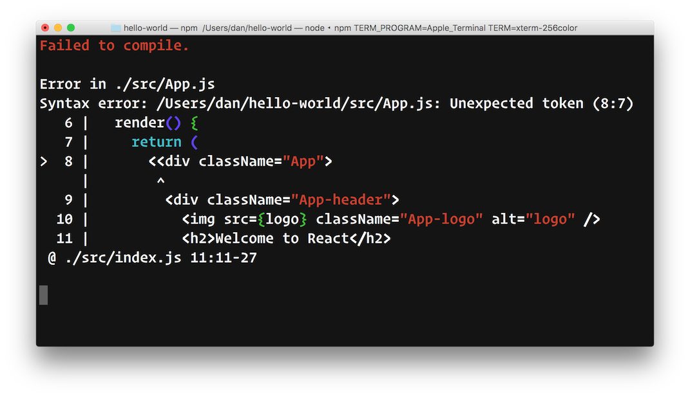
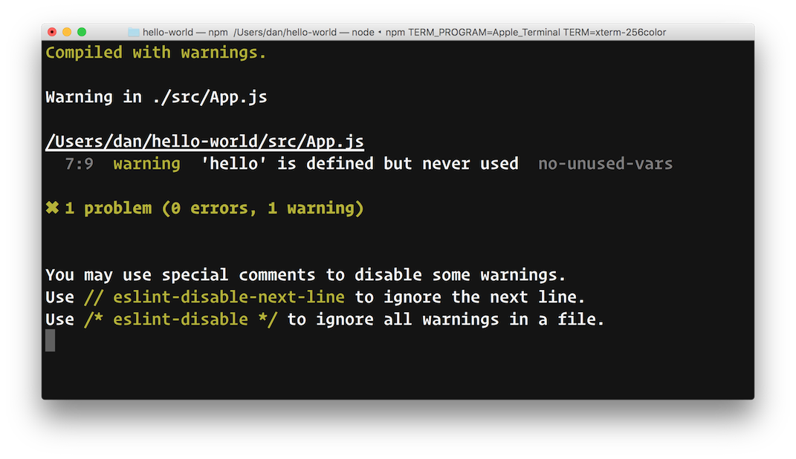
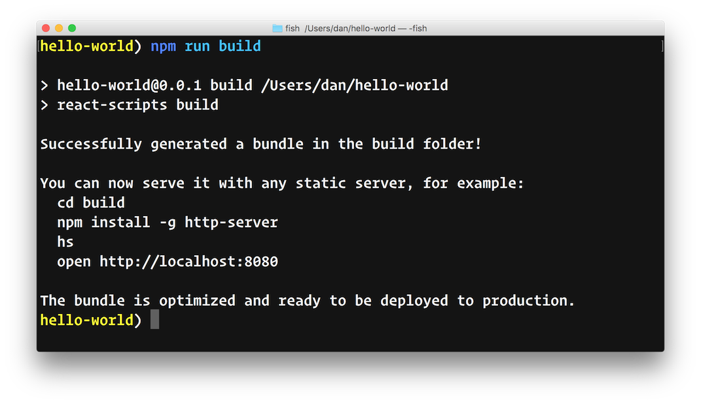

**[Create React App](https://github.com/facebookincubator/create-react-app)** is a new officially supported way to create single-page React applications. It offers a modern build setup with no configuration.

## Getting Started

### Installation

First, install the global package:

```sh
npm install -g create-react-app
```

Node.js 4.x or higher is required.

### Creating an App

Now you can use it to create a new app:

```sh
create-react-app hello-world
```

This will take a while as npm installs the transitive dependencies, but once it’s done, you will see a list of commands you can run in the created folder:



### Starting the Server

Run `npm start` to launch the development server. The browser will open automatically with the created app’s URL.



Create React App uses both webpack and Babel under the hood.
The console output is tuned to be minimal to help you focus on the problems:



ESLint is also integrated so lint warnings are displayed right in the console:



We only picked a small subset of lint rules that often lead to bugs.

### Building for Production

To build an optimized bundle, run `npm run build`:



It is minified, correctly envified, and the assets include content hashes for caching.

### One Dependency

Your `package.json` contains only a single build dependency and a few scripts:

```js
{
  "name": "hello-world",
  "dependencies": {
    "react": "^15.2.1",
    "react-dom": "^15.2.1"
  },
  "devDependencies": {
    "react-scripts": "0.1.0"
  },
  "scripts": {
    "start": "react-scripts start",
    "build": "react-scripts build",
    "eject": "react-scripts eject"
  }
}
```

We take care of updating Babel, ESLint, and webpack to stable compatible versions so you can update a single dependency to get them all.

### Zero Configuration

It is worth repeating: there are no configuration files or complicated folder structures. The tool only generates the files you need to build your app.

```
hello-world/
  README.md
  index.html
  favicon.ico
  node_modules/
  package.json
  src/
    App.css
    App.js
    index.css
    index.js
    logo.svg
```

All the build settings are preconfigured and can’t be changed. Some features, such as testing, are currently missing. This is an intentional limitation, and we recognize it might not work for everybody. And this brings us to the last point.

### No Lock-In

We first saw this feature in [Enclave](https://github.com/eanplatter/enclave), and we loved it. We talked to [Ean](https://twitter.com/EanPlatter), and he was excited to collaborate with us. He already sent a few pull requests!

“Ejecting” lets you leave the comfort of Create React App setup at any time. You run a single command, and all the build dependencies, configs, and scripts are moved right into your project. At this point you can customize everything you want, but effectively you are forking our configuration and going your own way. If you’re experienced with build tooling and prefer to fine-tune everything to your taste, this lets you use Create React App as a boilerplate generator.

We expect that at early stages, many people will “eject” for one reason or another, but as we learn from them, we will make the default setup more and more compelling while still providing no configuration.

## Try It Out!

You can find [**Create React App**](https://github.com/facebookincubator/create-react-app) with additional instructions on GitHub.

This is an experiment, and only time will tell if it becomes a popular way of creating and building React apps, or fades into obscurity.

We welcome you to participate in this experiment. Help us build the React tooling that more people can use. We are always [open to feedback](https://github.com/facebookincubator/create-react-app/issues/11).

## The Backstory

React was one of the first libraries to embrace transpiling JavaScript. As a result, even though you can [learn React without any tooling](https://github.com/facebook/react/blob/3fd582643ef3d222a00a0c756292c15b88f9f83c/examples/basic-jsx/index.html), the React ecosystem has commonly become associated with an overwhelming explosion of tools.

Eric Clemmons called this phenomenon the “[JavaScript Fatigue](https://medium.com/@ericclemmons/javascript-fatigue-48d4011b6fc4)”:

>Ultimately, the problem is that by choosing React (and inherently JSX), you’ve unwittingly opted into a confusing nest of build tools, boilerplate, linters, & time-sinks to deal with before you ever get to create anything.

It is tempting to write code in ES2015 and JSX. It is sensible to use a bundler to keep the codebase modular, and a linter to catch the common mistakes. It is nice to have a development server with fast rebuilds, and a command to produce optimized bundles for production.

Combining these tools requires some experience with each of them. Even so, it is far too easy to get dragged into fighting small incompatibilities, unsatisfied peerDependencies, and illegible configuration files.

Many of those tools are plugin platforms and don’t directly acknowledge each other’s existence. They leave it up to the users to wire them together. The tools mature and change independently, and tutorials quickly get out of date.

<blockquote class="twitter-tweet" data-lang="en"><p lang="en" dir="ltr">Marc was almost ready to implement his &quot;hello world&quot; React app <a href="https://t.co/ptdg4yteF1">pic.twitter.com/ptdg4yteF1</a></p>&mdash; Thomas Fuchs (@thomasfuchs) <a href="https://twitter.com/thomasfuchs/status/708675139253174273">March 12, 2016</a></blockquote>

This doesn’t mean those tools aren’t great. To many of us, they have become indispensable, and we very much appreciate the effort of their maintainers. They already have too much on their plates to worry about the state of the React ecosystem.

Still, we knew it was frustrating to spend days setting up a project when all you wanted was to learn React. We wanted to fix this.

## Could We Fix This?

We found ourselves in an unusual dilemma.

So far, [our strategy](/contributing/design-principles.html#dogfooding) has been to only release the code that we are using at Facebook. This helped us ensure that every project is battle-tested and has clearly defined scope and priorities.

However, tooling at Facebook is different than at many smaller companies. Linting, transpilation, and packaging are all handled by powerful remote development servers, and product engineers don’t need to configure them. While we wish we could give a dedicated server to every user of React, even Facebook cannot scale that well!

The React community is very important to us. We knew that we couldn’t fix the problem within the limits of our open source philosophy. This is why we decided to make an exception, and to ship something that we didn’t use ourselves, but that we thought would be useful to the community.

## The Quest for a React <abbr title="Command Line Interface">CLI</abbr>

Having just attended [EmberCamp](http://embercamp.com/) a week ago, I was excited about [Ember CLI](https://ember-cli.com/). Ember users have a great “getting started” experience thanks to a curated set of tools united under a single command-line interface. I have heard similar feedback about [Elm Reactor](https://github.com/elm-lang/elm-reactor).

Providing a cohesive curated experience is valuable by itself, even if the user could in theory assemble those parts themselves. Kathy Sierra [explains it best](http://seriouspony.com/blog/2013/7/24/your-app-makes-me-fat):

>If your UX asks the user to make *choices*, for example, even if those choices are both clear and useful, the act of *deciding* is a cognitive drain. And not just *while* they’re deciding... even *after* we choose, an unconscious cognitive background thread is slowly consuming/leaking resources, “Was *that* the right choice?”

I never tried to write a command-line tool for React apps, and neither has [Christopher](https://twitter.com/vjeux). We were chatting on Messenger about this idea, and we decided to work together on it for a week as a hackathon project.

We knew that such projects traditionally haven’t been very successful in the React ecosystem. Christopher told me that multiple “React CLI” projects have started and failed at Facebook. The community tools with similar goals also exist, but so far they have not yet gained enough traction.

Still, we decided it was worth another shot. Christopher and I created a very rough proof of concept on the weekend, and [Kevin](https://twitter.com/lacker) soon joined us.

We invited some of the community members to collaborate with us, and we have spent this week working on this tool. We hope that you’ll enjoy using it! [Let us know what you think.](https://github.com/facebookincubator/create-react-app/issues/11)

We would like to express our gratitude to [Max Stoiber](https://twitter.com/mxstbr), [Jonny Buchanan](https://twitter.com/jbscript), [Ean Platter](https://twitter.com/eanplatter), [Tyler McGinnis](https://github.com/tylermcginnis), [Kent C. Dodds](https://github.com/kentcdodds), and [Eric Clemmons](https://twitter.com/ericclemmons) for their early feedback, ideas, and contributions.
