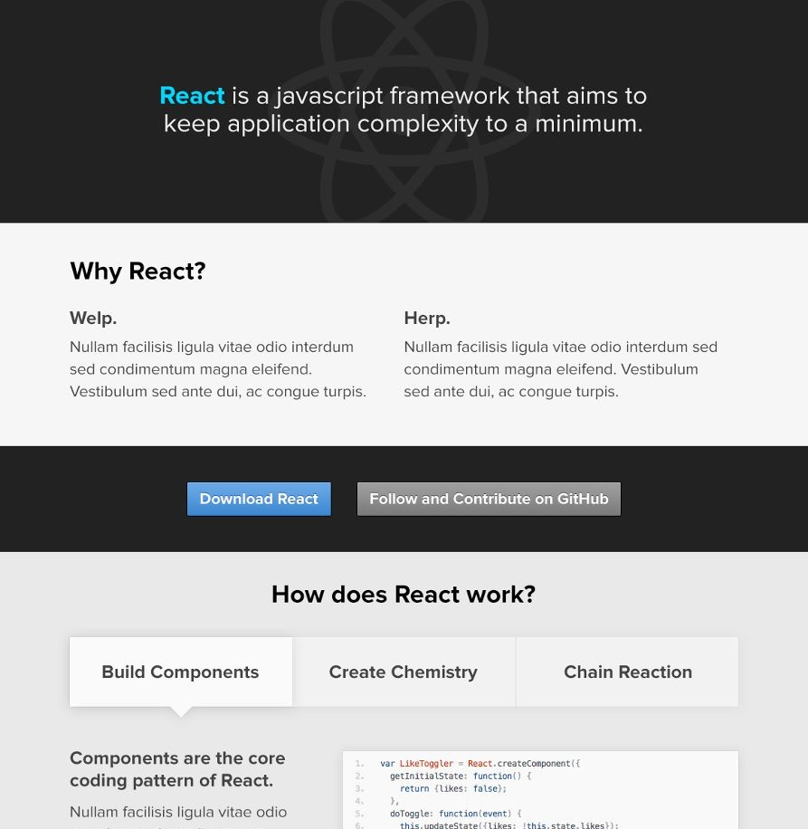

Just three and a half years ago we open sourced a little JavaScript library called React. The journey since that day has been incredibly exciting.

## Commemorative T-Shirt

In order to celebrate 50,000 GitHub stars, [Maggie Appleton](http://www.maggieappleton.com/) from [egghead.io](http://egghead.io/) has designed us a special T-shirt, which will be available for purchase from Teespring **only for a week** through Thursday, October 6. Maggie also wrote [a blog post](https://www.behance.net/gallery/43269677/Reacts-50000-Stars-Shirt) showing all the different concepts she came up with before settling on the final design.

<a target="_blank" href="https://teespring.com/react-50000-stars"></a>

The T-shirts are super soft using American Apparel's tri-blend fabric; we also have kids and toddler T-shirts and baby onesies available.

* [Adult T-shirts (straight-cut and fitted)](https://teespring.com/react-50000-stars)
* [Kids T-shirts](https://teespring.com/react-50000-stars-kids)
* [Toddler T-Shirts](https://teespring.com/react-50000-stars-toddler)
* [Baby Onesies](https://teespring.com/react-50000-stars-baby)

Proceeds from the shirts will be donated to [CODE2040](http://www.code2040.org/), a nonprofit that creates access, awareness, and opportunities in technology for underrepresented minorities with a specific focus on Black and Latinx talent.

## Archeology

We've spent a lot of time trying to explain the concepts behind React and the problems it attempts to solve, but we haven't talked much about how React evolved before being open sourced. This milestone seemed like as good a time as any to dig through the earliest commits and share some of the more important moments and fun facts.

The story begins in our ads org, where we were building incredibly sophisticated client side web apps using an internal MVC framework called [BoltJS](http://web.archive.org/web/20130608154901/http://shaneosullivan.github.io/boltjs/intro.html). Here's a sample of what some Bolt code looked like:

```js
var CarView = require('javelin/core').createClass({
  name: 'CarView',
  extend: require('container').Container,
  properties: {
    wheels: 4,
  },
  declare: function() {
    return {
      childViews: [
        { content: 'I have ' },
        { ref: 'wheelView' },
        { content: ' wheels' }
      ]
    };
  },
  setWheels: function(wheels) {
    this.findRef('wheelView').setContent(wheels);
  },
  getWheels: function() {
    return this.findRef('wheelView').getContent();
  },
});

var car = new CarView();
car.setWheels(3);
car.placeIn(document.body);
//<div>
//  <div>I have </div>
//  <div>3</div>
//  <div> wheels</div>
//</div>
```

Bolt introduced a number of APIs and features that would eventually make their way into React including `render`, `createClass`, and `refs`. Bolt introduced the concept of `refs` as a way to create references to nodes that can be used imperatively. This was relevant for legacy interoperability and incremental adoption, and while React would eventually strive to be a lot more functional, `refs` proved to be a very useful way to break out of the functional paradigm when the need arose.

But as our applications grew more and more sophisticated, our Bolt codebases got pretty complicated. Recognizing some of the framework's shortcomings, [Jordan Walke](https://twitter.com/jordwalke) started experimenting with a side-project called [FaxJS](https://github.com/jordwalke/FaxJs). His goal was to solve many of the same problems as Bolt, but in a very different way. This is actually where most of React's fundamentals were born, including props, state, re-evaluating large portions of the tree to “diff” the UI, server-side rendering, and a basic concept of components.

```js
TestProject.PersonDisplayer = {
  structure : function() {
    return Div({
      classSet: { personDisplayerContainer: true },
      titleDiv: Div({
        classSet: { personNameTitle: true },
        content: this.props.name
      }),
      nestedAgeDiv: Div({
        content: 'Interests: ' + this.props.interests
      })
    });
  }
};
```

## FBolt is Born

Through his FaxJS experiment, Jordan became convinced that functional APIs  — which discouraged mutation —  offered a better, more scalable way to build user interfaces. He imported his library into Facebook's codebase in March of 2012 and renamed it “FBolt”, signifying an extension of Bolt where components are written in a functional programming style. Or maybe “FBolt” was a nod to FaxJS – he didn't tell us! ;)

The interoperability between FBolt and Bolt allowed us to experiment with replacing just one component at a time with more functional component APIs. We could test the waters of this new functional paradigm, without having to go all in. We started with the components that were clearly best expressed functionally and then we would later continue to push the boundaries of what we could express as functions.

Realizing that FBolt wouldn't be a great name for the library when used on its own, Jordan Walke and [Tom Occhino](https://twitter.com/tomocchino) decided on a new name: “React.” After Tom sent out the diff to rename everything to React, Jordan commented:


> Jordan Walke:
I might add for the sake of discussion, that many systems advertise some kind of reactivity, but they usually require that you set up some kind of point-to-point listeners and won't work on structured data. This API reacts to any state or property changes, and works with data of any form (as deeply structured as the graph itself) so I think the name is fitting.


Most of Tom's other commits at the time were on the first version of [GraphiQL](https://github.com/graphql/graphiql), a project which was recently open sourced.

## Adding JSX

Since about 2010 Facebook has been using an extension of PHP called [XHP](https://www.facebook.com/notes/facebook-engineering/xhp-a-new-way-to-write-php/294003943919/), which enables engineers to create UIs using XML literals right inside their PHP code. It was first introduced to help prevent XSS holes but ended up being an excellent way to structure applications with custom components.

```js
final class :a:post extends :x:element {
  attribute :a;
  protected function render(): XHPRoot {
    $anchor = <a>{$this->getChildren()}</a>;
    $form = (
      <form
        method="post"
        action={$this->:href}
        target={$this->:target}
        class="postLink"
      >{$anchor}</form>
    );
    $this->transferAllAttributes($anchor);
    return $form;
  }
}
```

Before Jordan's work had even made its way into the Facebook codebase, Adam Hupp implemented an XHP-like concept for JavaScript, written in Haskell. This system enabled you to write the following inside a JavaScript file:

```js
function :example:hello(attrib, children) {
  return (
    <div class="special">
      <h1>Hello, World!</h1>
      {children}
    </div>
  );
}
```

It would compile the above into the following normal ES3-compatible JavaScript:

```js
function jsx_example_hello(attrib, children) {
  return (
    S.create("div", {"class": "special"}, [
      S.create("h1", {}, ["Hello, World!"]),
      children
    ]
  );
}
```

In this prototype, `S.create` would immediately create and return a DOM node. Most of the conversations on this prototype revolved around the performance characteristics of `innerHTML` versus creating DOM nodes directly. At the time, it would have been less than ideal to push developers universally in the direction of creating DOM nodes directly since it did not perform as well, especially in Firefox and IE. Facebook's then-CTO [Bret Taylor](https://twitter.com/btaylor) chimed in on the discussion at the time in favor of `innerHTML` over `document.createElement`:


> Bret Taylor:
If you are not convinced about innerHTML, here is a small microbenchmark. It is about the same in Chrome. innerHTML is about 30% faster in the latest version of Firefox (much more in previous versions), and about 90% faster in IE8.


This work was eventually abandoned but was revived after React made its way into the codebase. Jordan sidelined the previous performance discussions by introducing the concept of a “Virtual DOM,” though its eventual name didn't exist yet.


> Jordan Walke:
> For the first step, I propose that we do the easiest, yet most general transformation possible. My suggestion is to simply map xml expressions to function call expressions.
>
> - `<x></x>` becomes `x( )`
> - `<x height=12></x>` becomes `x( {height:12} )`
> - `<x> <y> </y> </x>` becomes `x({ childList: [y( )] })`
>
> At this point, JSX doesn't need to know about React - it's just a convenient way to write function calls. Coincidentally, React's primary abstraction is the function. Okay maybe it's not so coincidental ;)


Adam made a very insightful comment, which is now the default way we write lists in React with JSX.


> Adam Hupp:
> I think we should just treat arrays of elements as a frag. This is useful for constructs like:
>
> ```js
<ul>{foo.map(function(i) { return <li>{i.data}</li>; })}</ul>
```
>
> In this case the ul(..) will get a childList with a single child, which is itself a list.


React didn't end up using Adam's implementation directly. Instead, we created JSX by forking [js-xml-literal](https://github.com/laverdet/js-xml-literal), a side project by XHP creator Marcel Laverdet. JSX took its name from js-xml-literal, which Jordan modified to just be syntactic sugar for deeply nested function calls.

## API Churn

During the first year of React, internal adoption was growing quickly but there was quite a lot of churn in the component APIs and naming conventions:

* `project` was renamed to `declare` then to `structure` and finally to `render`.
* `Componentize` was renamed to `createComponent` and finally to `createClass`.

As the project was about to be open sourced, [Lee Byron](https://twitter.com/leeb) sat down with Jordan Walke, Tom Occhino and Sebastian Markbåge in order to refactor, reimplement, and rename one of React's most beloved features – the lifecycle API. Lee [came up with a well-designed API](https://gist.github.com/vjeux/f2b015d230cc1ab18ed1df30550495ed) that is still in place today.

* Concepts
    * component - a ReactComponent instance
    * state - internal state to a component
    * props - external state to a component
    * markup - the stringy HTML-ish stuff components generate
    * DOM - the document and elements within the document
* Actions
    * mount - to put a component into a DOM
    * initialize - to prepare a component for rendering
    * update - a transition of state (and props) resulting a render.
    * render - a side-effect-free process to get the representation (markup) of a component.
    * validate - make assertions about something created and provided
    * destroy - opposite of initialize
* Operands
    * create - make a new thing
    * get - get an existing thing
    * set - merge into existing
    * replace - replace existing
    * receive - respond to new data
    * force - skip checks to do action
* Notifications
    * shouldObjectAction
    * objectWillAction
    * objectDidAction

## Instagram

In 2012, Instagram got acquired by Facebook. [Pete Hunt](https://twitter.com/floydophone), who was working on Facebook photos and videos at the time, joined their newly formed web team. He wanted to build their website completely in React, which was in stark contrast with the incremental adoption model that had been used at Facebook.

To make this happen, React had to be decoupled from Facebook's infrastructure, since Instagram didn't use any of it. This project acted as a forcing function to do the work needed to open source React. In the process, Pete also discovered and promoted a little project called webpack. He also implemented the `renderToString` primitive which was needed to do server-side rendering.

As we started to prepare for the open source launch, [Maykel Loomans](https://twitter.com/miekd), a designer on Instagram, made a mock of what the website could look like. The header ended up defining the visual identity of React: its logo and the electric blue color!

<center><a target="_blank" href="../img/blog/react-50k-mock-full.jpg"></a></center>

In its earliest days, React benefited tremendously from feedback, ideas, and technical contributions of early adopters and collaborators all over the company. While it might look like an overnight success in hindsight, the story of React is actually a great example of how new ideas often need to go through several rounds of refinement, iteration, and course correction over a long period of time before reaching their full potential.

React's approach to building user interfaces with functional programming principles has changed the way we do things in just a few short years. It goes without saying, but React would be nothing without the amazing open source community that's built up around it!
