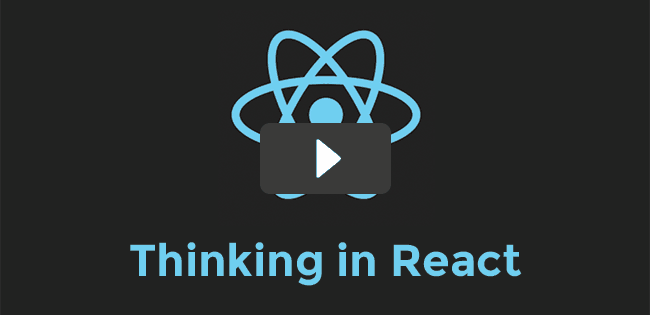

### Rethinking best practices - JSConf.eu

<iframe width="650" height="366" src="https://www.youtube-nocookie.com/embed/x7cQ3mrcKaY" frameborder="0" allowfullscreen></iframe>

"在 Facebook 和 Instagram, 我们正在努力挑战React在web上能达到的极限。我的讲话会从对框架的简单介绍开始，然后深入三个有争议的话题：扔掉模板的概念并用JavaScript构建views, 当数据改变 “re-rendering” 你的整个应用，以及一个DOM和events的轻量级实现。" -- [Pete Hunt](http://www.petehunt.net/)

* * *

### Thinking in react - tagtree.tv

一个 [tagtree.tv](http://tagtree.tv/) 传达 [Thinking in React](/docs/thinking-in-react.html) 原则的视频  在构建一个简单app时。
<figure></figure>

* * *

### Secrets of the Virtual DOM - MtnWest JS

<iframe width="650" height="366" src="https://www.youtube-nocookie.com/embed/h3KksH8gfcQ" frameborder="0" allowfullscreen></iframe>

"在这次讲座里，我会讨论为什么我们构建了一个虚拟 DOM，它比起其他系统如何，以及它与未来浏览器技术的关系。" -- [Pete Hunt](http://www.petehunt.net/)

* * *

### Going big with React

"理论上，所有的JS框架都大有可为：干净的实现,快速的代码设计,完美的执行。但是当你压力测试时Javascript会怎样？当你丢进6MB的代码时会怎样？在这次演讲中，我们会探究React在高压环境下如何表现，以及它如何帮助我们的团队在大规模时构建安全代码。 "
<figure></figure>

* * *

### CodeWinds

[Pete Hunt](http://www.petehunt.net/) 与 [Jeff Barczewski](http://jeff.barczewski.com/) 在 CodeWinds Episode 4 上关于 React 的谈话.
<figure></figure>

<table width="100%"><tr><td>
02:08 - 什么是React，为什么我们用它? 
03:08 - ClojureScript 和 React 的共生关系 
04:54 - React 的历史以及为什么它被创造 
09:43 - 用React更新Web页面，而不绑定数据 
13:11 - 用虚拟DOM来改变浏览器DOM 
13:57 - 用React编程，绘制目标HTML，canvas和其他 
16:45 - 和设计师一起工作，对比于Ember 和 AngularJS 
21:45 - JSX编译器桥接HTML和 React javascript 
23:50 - React的自动绑定JSX以及浏览器内工具 
24:50 - 用React工作的提示和技巧，入门 
</td><td>
27:17 - 在服务器端用Node.js渲染HTML。后端渲染 
29:20 - React在Facebook通过优胜劣汰进化 
30:15 - 用web sockets，在服务器端和客户端持有状态的想法持有 
32:05 - 多用户React - 用 Firebase 分布式共享可变状态 
33:03 - 用状态转换，事件重放来更好的调式React 
34:08 - 来自Web组件的不同之处 
34:25 - 使用React的著名公司 
35:16 - 一个React的后端插件可以用来创建PDF吗? 
36:30 - React的未来，下一步是什么? 
39:38 - 贡献和获得帮助 
</td></tr></table>

[Read the episode notes](http://codewinds.com/4)

* * *

### JavaScript Jabber

[Pete Hunt](http://www.petehunt.net/) 和 [Jordan Walke](https://github.com/jordwalke) 在 JavaScript Jabber 73 上关于React的谈话.
<figure></figure>

<table width="100%"><tr><td>
01:34 – Pete Hunt 介绍 
02:45 – Jordan Walke 介绍 
04:15 – React 
06:38 – 60 帧每秒 
09:34 – 数据绑定 
12:31 – 性能 
17:39 – Diffing 算法 
19:36 – DOM 操纵
</td><td>
23:06 – 支持 node.js 
24:03 – rendr 
26:02 – JSX 
30:31 – requestAnimationFrame 
34:15 – React 和应用 
38:12 – React 用户 Khan Academy 
39:53 – 使其工作
</td></tr></table>

[Read the full transcript](http://javascriptjabber.com/073-jsj-react-with-pete-hunt-and-jordan-walke/)

* * *

### Introduction to React.js - Facebook Seattle

<iframe width="650" height="366" src="https://www.youtube-nocookie.com/embed/XxVg_s8xAms" frameborder="0" allowfullscreen></iframe>

由 [Tom Occhino](http://tomocchino.com/) 和 [Jordan Walke](https://github.com/jordwalke)

* * *

### Backbone + React + Middleman Screencast
<iframe width="650" height="488" src="https://www.youtube-nocookie.com/embed/iul1fWHVU6A" frameborder="0" allowfullscreen></iframe>

Backbone 是一个在用React实现 REST API 接口的极好方法。这个屏博展示了用 [Backbone-React-Component](https://github.com/magalhas/backbone-react-component)如何整合两者. Middleman 是在本例中使用的框架但很容易被替换成其他框架。对此可支持的template可以在[这里](https://github.com/jbhatab/middleman-backbone-react-template) 找到. -- [Open Minded Innovations](http://www.openmindedinnovations.com/)

* * *

### Developing User Interfaces With React - Super VanJS

<iframe width="650" height="366" src="https://www.youtube-nocookie.com/embed/1OeXsL5mr4g" frameborder="0" allowfullscreen></iframe>

来自 [Steven Luscher](https://github.com/steveluscher)

* * *

### Introduction to React - LAWebSpeed meetup

<iframe width="650" height="366" src="https://www.youtube-nocookie.com/embed/SMMRJif5QW0" frameborder="0" allowfullscreen></iframe>

来自 [Stoyan Stefanov](http://www.phpied.com/)

* * *

### React, or how to make life simpler - FrontEnd Dev Conf '14

<iframe width="650" height="366" src="https://www.youtube-nocookie.com/embed/YJNUK0EA_Jo" frameborder="0" allowfullscreen></iframe>

**俄语** by [Alexander Solovyov](http://solovyov.net/)

* * *

### "Functional DOM programming" - Meteor DevShop 11

<iframe width="650" height="366" src="https://www.youtube-nocookie.com/embed/qqVbr_LaCIo" frameborder="0" allowfullscreen></iframe>

* * *

### "Rethinking Web App Development at Facebook" - Facebook F8 Conference 2014

<iframe width="650" height="366" src="https://www.youtube-nocookie.com/embed/nYkdrAPrdcw" frameborder="0" allowfullscreen></iframe>

* * *

### React and Flux: Building Applications with a Unidirectional Data Flow - Forward JS 2014

<iframe width="650" height="366" src="https://www.youtube-nocookie.com/embed/i__969noyAM" frameborder="0" allowfullscreen></iframe>

Facebook 工程师 [Bill Fisher](https://twitter.com/fisherwebdev) 和 [Jing Chen](https://twitter.com/jingc) 谈论 Flux 和 React, 以及如何使用单向数据流的程序架构清理他们的代码 .

* * *

### Server-Side Rendering of Isomorphic Apps at SoundCloud

<iframe src="https://player.vimeo.com/video/108488724" width="100%" height="365" frameborder="0" webkitallowfullscreen mozallowfullscreen allowfullscreen></iframe>

来自 [Andres Suarez](https://github.com/zertosh) 的演练，关于 [SoundCloud](https://developers.soundcloud.com/blog/) 如何使用 React 和 Flux 在服务器端渲染.

[幻灯片和示例代码](https://github.com/zertosh/ssr-demo-kit)

* * *

### Introducing React Native (+Playlist) - React.js Conf 2015

<iframe width="650" height="366" src="https://www.youtube-nocookie.com/embed/KVZ-P-ZI6W4?list=PLb0IAmt7-GS1cbw4qonlQztYV1TAW0sCr" frameborder="0" allowfullscreen></iframe>

[Tom Occhino](https://twitter.com/tomocchino) 回顾了React的过去和现在，在2015年。梳理了下一步要做什么。
