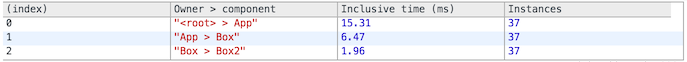
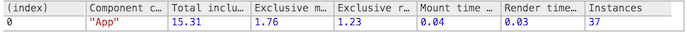
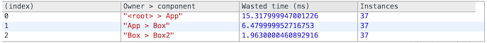
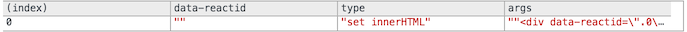

> Note:
>
> As of React 16, `react-addons-perf` is not supported. Please use [your browser's profiling tools](/docs/optimizing-performance.html#profiling-components-with-the-chrome-performance-tab) to get insight into which components re-render.

**Importing**

```javascript
import Perf from 'react-addons-perf'; // ES6
var Perf = require('react-addons-perf'); // ES5 with npm
```


## Overview

React is usually quite fast out of the box. However, in situations where you need to squeeze every ounce of performance out of your app, it provides a [shouldComponentUpdate()](/docs/react-component.html#shouldcomponentupdate) hook where you can add optimization hints to React's diff algorithm.

In addition to giving you an overview of your app's overall performance, `Perf` is a profiling tool that tells you exactly where you need to put these hooks.

See these articles for an introduction to React performance tooling:

 - ["How to Benchmark React Components"](https://medium.com/code-life/how-to-benchmark-react-components-the-quick-and-dirty-guide-f595baf1014c)
 - ["Performance Engineering with React"](http://benchling.engineering/performance-engineering-with-react/)
 - ["A Deep Dive into React Perf Debugging"](http://benchling.engineering/deep-dive-react-perf-debugging/) 

### Development vs. Production Builds

If you're benchmarking or seeing performance problems in your React apps, make sure you're testing with the [minified production build](/downloads.html). The development build includes extra warnings that are helpful when building your apps, but it is slower due to the extra bookkeeping it does.

However, the perf tools described on this page only work when using the development build of React. Therefore, the profiler only serves to indicate the _relatively_ expensive parts of your app.

### Using Perf

The `Perf` object can be used with React in development mode only. You should not include this bundle when building your app for production.

#### Getting Measurements

 - [`start()`](#start)
 - [`stop()`](#stop)
 - [`getLastMeasurements()`](#getlastmeasurements)

#### Printing Results

The following methods use the measurements returned by [`Perf.getLastMeasurements()`](#getlastmeasurements) to pretty-print the result.

 - [`printInclusive()`](#printinclusive)
 - [`printExclusive()`](#printexclusive)
 - [`printWasted()`](#printwasted)
 - [`printOperations()`](#printoperations)
 - [`printDOM()`](#printdom)

* * *

## Reference

### `start()`
### `stop()`

```javascript
Perf.start()
// ...
Perf.stop()
```

Start/stop the measurement. The React operations in-between are recorded for analyses below. Operations that took an insignificant amount of time are ignored.

After stopping, you will need [`Perf.getLastMeasurements()`](#getlastmeasurements) to get the measurements.

* * *

### `getLastMeasurements()`

```javascript
Perf.getLastMeasurements()
```

Get the opaque data structure describing measurements from the last start-stop session. You can save it and pass it to the other print methods in [`Perf`](#printing-results) to analyze past measurements.

> Note
>
> Don't rely on the exact format of the return value because it may change in minor releases. We will update the documentation if the return value format becomes a supported part of the public API.

* * *

### `printInclusive()`

```javascript
Perf.printInclusive(measurements)
```

Prints the overall time taken. When no arguments are passed, `printInclusive` defaults to all the measurements from the last recording. This prints a nicely formatted table in the console, like so:



* * *

### `printExclusive()`

```javascript
Perf.printExclusive(measurements)
```

"Exclusive" times don't include the times taken to mount the components: processing props, calling `componentWillMount` and `componentDidMount`, etc.



* * *

### `printWasted()`

```javascript
Perf.printWasted(measurements)
```

**The most useful part of the profiler**.

"Wasted" time is spent on components that didn't actually render anything, e.g. the render stayed the same, so the DOM wasn't touched.



* * *

### `printOperations()`

```javascript
Perf.printOperations(measurements)
```

Prints the underlying DOM manipulations, e.g. "set innerHTML" and "remove".



* * *

### `printDOM()`

```javascript
Perf.printDOM(measurements)
```

This method has been renamed to [`printOperations()`](#printoperations). Currently `printDOM()` still exists as an alias but it prints a deprecation warning and will eventually be removed.
