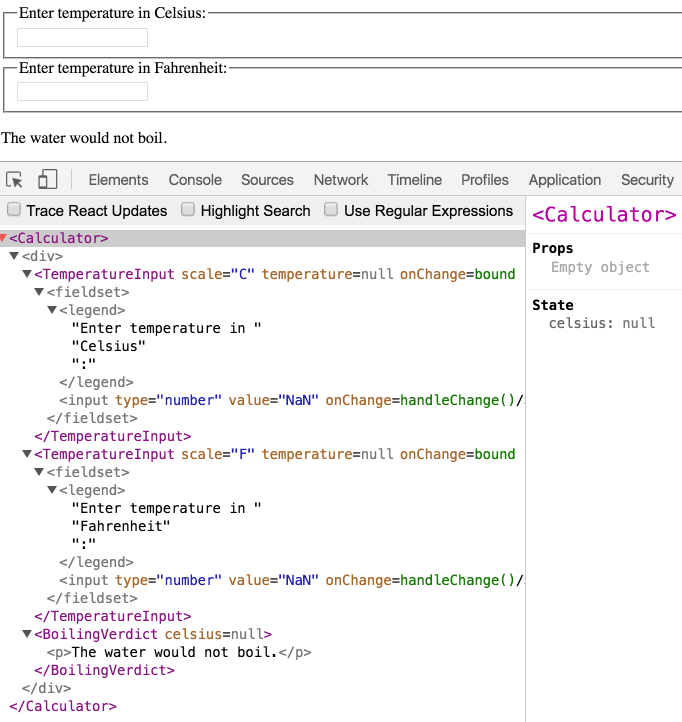

Often, several components need to reflect the same changing data. We recommend lifting the shared state up to their closest common ancestor. Let's see how this works in action.

In this section, we will create a temperature calculator that calculates whether the water would boil at a given temperature.

We will start with a component called `BoilingVerdict`. It accepts the `celsius` temperature as a prop, and prints whether it is enough to boil the water:

```js{3,5}
function BoilingVerdict(props) {
  if (props.celsius >= 100) {
    return <p>The water would boil.</p>;
  }
  return <p>The water would not boil.</p>;
}
```

Next, we will create a component called `Calculator`. It renders an `<input>` that lets you enter the temperature, and keeps its value in `this.state.temperature`.

Additionally, it renders the `BoilingVerdict` for the current input value.

```js{5,9,13,17-21}
class Calculator extends React.Component {
  constructor(props) {
    super(props);
    this.handleChange = this.handleChange.bind(this);
    this.state = {temperature: ''};
  }

  handleChange(e) {
    this.setState({temperature: e.target.value});
  }

  render() {
    const temperature = this.state.temperature;
    return (
      <fieldset>
        <legend>Enter temperature in Celsius:</legend>
        <input
          value={temperature}
          onChange={this.handleChange} />
        <BoilingVerdict
          celsius={parseFloat(temperature)} />
      </fieldset>
    );
  }
}
```

[Try it on CodePen.](https://codepen.io/gaearon/pen/ZXeOBm?editors=0010)

## Adding a Second Input

Our new requirement is that, in addition to a Celsius input, we provide a Fahrenheit input, and they are kept in sync.

We can start by extracting a `TemperatureInput` component from `Calculator`. We will add a new `scale` prop to it that can either be `"c"` or `"f"`:

```js{1-4,19,22}
const scaleNames = {
  c: 'Celsius',
  f: 'Fahrenheit'
};

class TemperatureInput extends React.Component {
  constructor(props) {
    super(props);
    this.handleChange = this.handleChange.bind(this);
    this.state = {temperature: ''};
  }

  handleChange(e) {
    this.setState({temperature: e.target.value});
  }

  render() {
    const temperature = this.state.temperature;
    const scale = this.props.scale;
    return (
      <fieldset>
        <legend>Enter temperature in {scaleNames[scale]}:</legend>
        <input value={temperature}
               onChange={this.handleChange} />
      </fieldset>
    );
  }
}
```

We can now change the `Calculator` to render two separate temperature inputs:

```js{5,6}
class Calculator extends React.Component {
  render() {
    return (
      <div>
        <TemperatureInput scale="c" />
        <TemperatureInput scale="f" />
      </div>
    );
  }
}
```

[Try it on CodePen.](https://codepen.io/gaearon/pen/jGBryx?editors=0010)

We have two inputs now, but when you enter the temperature in one of them, the other doesn't update. This contradicts our requirement: we want to keep them in sync.

We also can't display the `BoilingVerdict` from `Calculator`. The `Calculator` doesn't know the current temperature because it is hidden inside the `TemperatureInput`.

## Writing Conversion Functions

First, we will write two functions to convert from Celsius to Fahrenheit and back:

```js
function toCelsius(fahrenheit) {
  return (fahrenheit - 32) * 5 / 9;
}

function toFahrenheit(celsius) {
  return (celsius * 9 / 5) + 32;
}
```

These two functions convert numbers. We will write another function that takes a string `temperature` and a converter function as arguments and returns a string. We will use it to calculate the value of one input based on the other input.

It returns an empty string on an invalid `temperature`, and it keeps the output rounded to the third decimal place:

```js
function tryConvert(temperature, convert) {
  const input = parseFloat(temperature);
  if (Number.isNaN(input)) {
    return '';
  }
  const output = convert(input);
  const rounded = Math.round(output * 1000) / 1000;
  return rounded.toString();
}
```

For example, `tryConvert('abc', toCelsius)` returns an empty string, and `tryConvert('10.22', toFahrenheit)` returns `'50.396'`.

## Lifting State Up

Currently, both `TemperatureInput` components independently keep their values in the local state:

```js{5,9,13}
class TemperatureInput extends React.Component {
  constructor(props) {
    super(props);
    this.handleChange = this.handleChange.bind(this);
    this.state = {temperature: ''};
  }

  handleChange(e) {
    this.setState({temperature: e.target.value});
  }

  render() {
    const temperature = this.state.temperature;
```

However, we want these two inputs to be in sync with each other. When we update the Celsius input, the Fahrenheit input should reflect the converted temperature, and vice versa.

In React, sharing state is accomplished by moving it up to the closest common ancestor of the components that need it. This is called "lifting state up". We will remove the local state from the `TemperatureInput` and move it into the `Calculator` instead.

If the `Calculator` owns the shared state, it becomes the "source of truth" for the current temperature in both inputs. It can instruct them both to have values that are consistent with each other. Since the props of both `TemperatureInput` components are coming from the same parent `Calculator` component, the two inputs will always be in sync.

Let's see how this works step by step.

First, we will replace `this.state.temperature` with `this.props.temperature` in the `TemperatureInput` component. For now, let's pretend `this.props.temperature` already exists, although we will need to pass it from the `Calculator` in the future:

```js{3}
  render() {
    // Before: const temperature = this.state.temperature;
    const temperature = this.props.temperature;
```

We know that [props are read-only](/docs/components-and-props.html#props-are-read-only). When the `temperature` was in the local state, the `TemperatureInput` could just call `this.setState()` to change it. However, now that the `temperature` is coming from the parent as a prop, the `TemperatureInput` has no control over it.

In React, this is usually solved by making a component "controlled". Just like the DOM `<input>` accepts both a `value` and an `onChange` prop, so can the custom `TemperatureInput` accept both `temperature` and `onTemperatureChange` props from its parent `Calculator`.

Now, when the `TemperatureInput` wants to update its temperature, it calls `this.props.onTemperatureChange`:

```js{3}
  handleChange(e) {
    // Before: this.setState({temperature: e.target.value});
    this.props.onTemperatureChange(e.target.value);
```

>Note:
>
>There is no special meaning to either `temperature` or `onTemperatureChange` prop names in custom components. We could have called them anything else, like name them `value` and `onChange` which is a common convention.

The `onTemperatureChange` prop will be provided together with the `temperature` prop by the parent `Calculator` component. It will handle the change by modifying its own local state, thus re-rendering both inputs with the new values. We will look at the new `Calculator` implementation very soon.

Before diving into the changes in the `Calculator`, let's recap our changes to the `TemperatureInput` component. We have removed the local state from it, and instead of reading `this.state.temperature`, we now read `this.props.temperature`. Instead of calling `this.setState()` when we want to make a change, we now call `this.props.onTemperatureChange()`, which will be provided by the `Calculator`:

```js{8,12}
class TemperatureInput extends React.Component {
  constructor(props) {
    super(props);
    this.handleChange = this.handleChange.bind(this);
  }

  handleChange(e) {
    this.props.onTemperatureChange(e.target.value);
  }

  render() {
    const temperature = this.props.temperature;
    const scale = this.props.scale;
    return (
      <fieldset>
        <legend>Enter temperature in {scaleNames[scale]}:</legend>
        <input value={temperature}
               onChange={this.handleChange} />
      </fieldset>
    );
  }
}
```

Now let's turn to the `Calculator` component.

We will store the current input's `temperature` and `scale` in its local state. This is the state we "lifted up" from the inputs, and it will serve as the "source of truth" for both of them. It is the minimal representation of all the data we need to know in order to render both inputs.

For example, if we enter 37 into the Celsius input, the state of the `Calculator` component will be:

```js
{
  temperature: '37',
  scale: 'c'
}
```

If we later edit the Fahrenheit field to be 212, the state of the `Calculator` will be:

```js
{
  temperature: '212',
  scale: 'f'
}
```

We could have stored the value of both inputs but it turns out to be unnecessary. It is enough to store the value of the most recently changed input, and the scale that it represents. We can then infer the value of the other input based on the current `temperature` and `scale` alone.

The inputs stay in sync because their values are computed from the same state:

```js{6,10,14,18-21,27-28,31-32,34}
class Calculator extends React.Component {
  constructor(props) {
    super(props);
    this.handleCelsiusChange = this.handleCelsiusChange.bind(this);
    this.handleFahrenheitChange = this.handleFahrenheitChange.bind(this);
    this.state = {temperature: '', scale: 'c'};
  }

  handleCelsiusChange(temperature) {
    this.setState({scale: 'c', temperature});
  }

  handleFahrenheitChange(temperature) {
    this.setState({scale: 'f', temperature});
  }

  render() {
    const scale = this.state.scale;
    const temperature = this.state.temperature;
    const celsius = scale === 'f' ? tryConvert(temperature, toCelsius) : temperature;
    const fahrenheit = scale === 'c' ? tryConvert(temperature, toFahrenheit) : temperature;

    return (
      <div>
        <TemperatureInput
          scale="c"
          temperature={celsius}
          onTemperatureChange={this.handleCelsiusChange} />
        <TemperatureInput
          scale="f"
          temperature={fahrenheit}
          onTemperatureChange={this.handleFahrenheitChange} />
        <BoilingVerdict
          celsius={parseFloat(celsius)} />
      </div>
    );
  }
}
```

[Try it on CodePen.](https://codepen.io/gaearon/pen/WZpxpz?editors=0010)

Now, no matter which input you edit, `this.state.temperature` and `this.state.scale` in the `Calculator` get updated. One of the inputs gets the value as is, so any user input is preserved, and the other input value is always recalculated based on it.

Let's recap what happens when you edit an input:

* React calls the function specified as `onChange` on the DOM `<input>`. In our case, this is the `handleChange` method in `TemperatureInput` component.
* The `handleChange` method in the `TemperatureInput` component calls `this.props.onTemperatureChange()` with the new desired value. Its props, including `onTemperatureChange`, were provided by its parent component, the `Calculator`.
* When it previously rendered, the `Calculator` has specified that `onTemperatureChange` of the Celsius `TemperatureInput` is the `Calculator`'s `handleCelsiusChange` method, and `onTemperatureChange` of the Fahrenheit `TemperatureInput` is the `Calculator`'s `handleFahrenheitChange` method. So either of these two `Calculator` methods gets called depending on which input we edited.
* Inside these methods, the `Calculator` component asks React to re-render itself by calling `this.setState()` with the new input value and the current scale of the input we just edited.
* React calls the `Calculator` component's `render` method to learn what the UI should look like. The values of both inputs are recomputed based on the current temperature and the active scale. The temperature conversion is performed here.
* React calls the `render` methods of the individual `TemperatureInput` components with their new props specified by the `Calculator`. It learns what their UI should look like.
* React DOM updates the DOM to match the desired input values. The input we just edited receives its current value, and the other input is updated to the temperature after conversion.

Every update goes through the same steps so the inputs stay in sync.

## Lessons Learned

There should be a single "source of truth" for any data that changes in a React application. Usually, the state is first added to the component that needs it for rendering. Then, if other components also need it, you can lift it up to their closest common ancestor. Instead of trying to sync the state between different components, you should rely on the [top-down data flow](/docs/state-and-lifecycle.html#the-data-flows-down).

Lifting state involves writing more "boilerplate" code than two-way binding approaches, but as a benefit, it takes less work to find and isolate bugs. Since any state "lives" in some component and that component alone can change it, the surface area for bugs is greatly reduced. Additionally, you can implement any custom logic to reject or transform user input.

If something can be derived from either props or state, it probably shouldn't be in the state. For example, instead of storing both `celsiusValue` and `fahrenheitValue`, we store just the last edited `temperature` and its `scale`. The value of the other input can always be calculated from them in the `render()` method. This lets us clear or apply rounding to the other field without losing any precision in the user input.

When you see something wrong in the UI, you can use [React Developer Tools](https://github.com/facebook/react-devtools) to inspect the props and move up the tree until you find the component responsible for updating the state. This lets you trace the bugs to their source:


