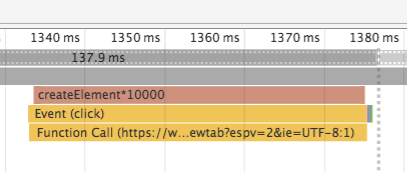
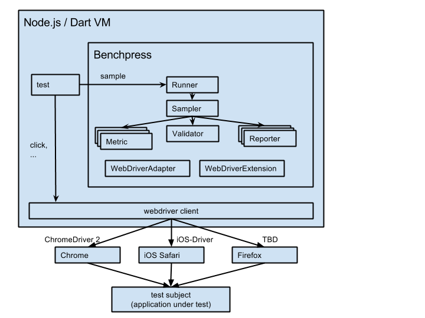

# Benchpress

Benchpress is a framework for e2e performance tests.
See [here for an example project](https://github.com/angular/benchpress-tree).

# Why?

There are so called "micro benchmarks" that essentially use a stop watch in the browser to measure time
(e.g. via `performance.now()`). This approach is limited to time, and in some cases memory
(Chrome with special flags), as metric. It does not allow to measure:

- rendering time: e.g. the time the browser spends to layout or paint elements. This can e.g. used to
  test the performance impact of stylesheet changes.
- garbage collection: e.g. how long the browser paused script execution, and how much memory was collected.
  This can be used to stabilize script execution time, as garbage collection times are usually very
  unpredictable. This data can also be used to measure and improve memory usage of applications,
  as the garbage collection amount directly affects garbage collection time.
- distinguish script execution time from waiting: e.g. to measure the client side only time that is spent
  in a complex user interaction, ignoring backend calls.
- measure fps to assert the smoothness of scrolling and animations.

This kind of data is already available in the DevTools of modern browsers. However, there is no standard way to
use those tools in an automated way to measure web app performance, especially not across platforms.

Benchpress tries to fill this gap, i.e. allow to access all kinds of performance metrics in an automated way.


# How it works

Benchpress uses webdriver to read out the so called "performance log" of browsers. This contains all kinds of interesting
data, e.g. when a script started/ended executing, gc started/ended, the browser painted something to the screen, ...

As browsers are different, benchpress has plugins to normalizes these events.


# Features

* Provides a loop (so called "Sampler") that executes the benchmark multiple times
* Automatically waits/detects until the browser is "warm"
* Reporters provide a normalized way to store results:
  - console reporter
  - file reporter
  - Google Big Query reporter (coming soon)
* Supports micro benchmarks as well via `console.time()` / `console.timeEnd()`
  - `console.time()` / `console.timeEnd()` mark the timeline in the DevTools, so it makes sense
    to use them in micro benchmark to visualize and understand them, with or without benchpress.
  - running micro benchmarks in benchpress leverages the already existing reporters,
    the sampler and the auto warmup feature of benchpress.


# Supported browsers

* Chrome on all platforms
* Mobile Safari (iOS)
* Firefox (work in progress)


# How to write a benchmark

A benchmark in benchpress is made by an application under test
and a benchmark driver. The application under test is the
actual application consisting of html/css/js that should be tests.
A benchmark driver is a webdriver test that interacts with the
application under test.


## A simple benchmark

Let's assume we want to measure the script execution time, as well as the render time
that it takes to fill a container element with a complex html string.

The application under test could look like this:

```
index.html:

<button id="reset" onclick="reset()">Reset</button>
<button id="fill" onclick="fill()">fill innerHTML</button>
<div id="container"></div>
<script>
  var container = document.getElementById('container');
  var complexHtmlString = '...'; // TODO

  function reset() { container.innerHTML = ''; }

  function fill() {
    container.innerHTML = complexHtmlString;
  }
</script>
```

A benchmark driver could look like this:

```
// A runner contains the shared configuration
// and can be shared across multiple tests.
var runner = new Runner(...);

driver.get('http://myserver/index.html');

var resetBtn = driver.findElement(By.id('reset'));
var fillBtn = driver.findElement(By.id('fill'));

runner.sample({
  id: 'fillElement',
  // Prepare is optional...
  prepare: () {
    resetBtn.click();
  },
  execute: () {
    fillBtn.click();
    // Note: if fillBtn would use some asynchronous code,
    // we would need to wait here for its end.
  }
});
```

## Measuring in the browser

If the application under test would like to, it can measure on its own.
E.g.

```
index.html:

<button id="measure" onclick="measure()">Measure document.createElement</button>
<script>
  function measure() {
    console.time('createElement*10000');
    for (var i=0; i<100000; i++) {
      document.createElement('div');
    }
    console.timeEnd('createElement*10000');
  }
</script>
```

When the `measure` button is clicked, it marks the timeline and creates 10000 elements.
It uses the special names `createElement*10000` to tell benchpress that the
time that was measured is for 10000 calls to createElement and that benchpress should
take the average for it.

A test driver for this would look like this:

````
driver.get('.../index.html');

var measureBtn = driver.findElement(By.id('measure'));
runner.sample({
  id: 'createElement test',
  microMetrics: {
    'createElement': 'time to create an element (ms)'
  },
  execute: () {
    measureBtn.click();
  }
});
````

When looking into the DevTools Timeline, we see a marker as well:


### Custom Metrics Without Using `console.time`

It's also possible to measure any "user metric" within the browser
by setting a numeric value on the `window` object. For example:

```js
bootstrap(App)
  .then(() => {
    window.timeToBootstrap = Date.now() - performance.timing.navigationStart;
  });
```

A test driver for this user metric could be written as follows:

```js

describe('home page load', function() {
  it('should log load time for a 2G connection', done => {
    runner.sample({
      execute: () => {
        browser.get(`http://localhost:8080`);
      },
      userMetrics: {
        timeToBootstrap: 'The time in milliseconds to bootstrap'
      },
      bindings: [
        bind(RegressionSlopeValidator.METRIC).toValue('timeToBootstrap')
      ]
    }).then(done);
  });
});
```

Using this strategy, benchpress will wait until the specified property name,
`timeToBootstrap` in this case, is defined as a number on the `window` object
inside the application under test.

# Smoothness Metrics

Benchpress can also measure the "smoothness" of scrolling and animations. In order to do that, the following set of metrics can be collected by benchpress:

- `frameTime.mean`: mean frame time in ms (target: 16.6ms for 60fps)
- `frameTime.worst`: worst frame time in ms
- `frameTime.best`: best frame time in ms
- `frameTime.smooth`: percentage of frames that hit 60fps

To collect these metrics, you need to execute `console.time('frameCapture')` and `console.timeEnd('frameCapture')` either in your benchmark application or in you benchmark driver via webdriver. The metrics mentioned above will only be collected between those two calls and it is recommended to wrap the time/timeEnd calls as closely as possible around the action you want to evaluate to get accurate measurements.

In addition to that, one extra binding needs to be passed to benchpress in tests that want to collect these metrics:

    benchpress.sample(providers: [bp.bind(bp.Options.CAPTURE_FRAMES).toValue(true)], ... )

# Requests Metrics

Benchpress can also record the number of requests sent and count the received "encoded" bytes since [window.performance.timing.navigationStart](http://www.w3.org/TR/navigation-timing/#dom-performancetiming-navigationstart):

- `receivedData`: number of bytes received since the last navigation start
- `requestCount`: number of requests sent since the last navigation start

To collect these metrics, you need the following corresponding extra providers:

    benchpress.sample(providers: [
      bp.bind(bp.Options.RECEIVED_DATA).toValue(true),
      bp.bind(bp.Options.REQUEST_COUNT).toValue(true)
    ], ... )

# Best practices

* Use normalized environments
  - metrics that are dependent on the performance of the execution environment must be executed on a normalized machine
  - e.g. a real mobile device whose cpu frequency is set to a fixed value.
      * see our [build script](https://github.com/angular/angular/blob/master/scripts/ci/android_cpu.sh)
      * this requires root access, e.g. via a userdebug build of Android on a Google Nexus device
        (see [here](https://source.android.com/source/building-running.html) and [here](https://source.android.com/source/building-devices.html#obtaining-proprietary-binaries))
  - e.g. a calibrated machine that does not run background jobs, has a fixed cpu frequency, ...

* Use relative comparisons
  - relative comparisons are less likely to change over time and help to interpret the results of benchmarks
  - e.g. compare an example written using a ui framework against a hand coded example and track the ratio

* Assert post-commit for commit ranges
  - running benchmarks can take some time. Running them before every commit is usually too slow.
  - when a regression is detected for a commit range, use bisection to find the problematic commit

* Repeat benchmarks multiple times in a fresh window
  - run the same benchmark multiple times in a fresh window and then take the minimal average value of each benchmark run

* Use force gc with care
  - forcing gc can skew the script execution time and gcTime numbers,
    but might be needed to get stable gc time / gc amount numbers

* Open a new window for every test
  - browsers (e.g. chrome) might keep JIT statistics over page reloads and optimize pages differently depending on what has been loaded before

# Detailed overview



Definitions:

* valid sample: a sample that represents the world that should be measured in a good way.
* complete sample: sample of all measure values collected so far

Components:

* Runner
  - contains a default configuration
  - creates a new injector for every sample call, via which all other components are created

* Sampler
  - gets data from the metrics
  - reports measure values immediately to the reporters
  - loops until the validator is able to extract a valid sample out of the complete sample (see below).
  - reports the valid sample and the complete sample to the reporters

* Metric
  - gets measure values from the browser
  - e.g. reads out performance logs, DOM values, JavaScript values

* Validator
  - extracts a valid sample out of the complete sample of all measure values.
  - e.g. wait until there are 10 samples and take them as valid sample (would include warmup time)
  - e.g. wait until the regression slope for the metric `scriptTime` through the last 10 measure values is >=0, i.e. the values for the `scriptTime` metric are no more decreasing

* Reporter
  - reports measure values, the valid sample and the complete sample to backends
  - e.g. a reporter that prints to the console, a reporter that reports values into Google BigQuery, ...

* WebDriverAdapter
  - abstraction over the used web driver client
  - one implementation for every webdriver client
    E.g. one for selenium-webdriver Node.js module, dart async webdriver, dart sync webdriver, ...

* WebDriverExtension
  - implements additional methods that are standardized in the webdriver protocol using the WebDriverAdapter
  - provides functionality like force gc, read out performance logs in a normalized format
  - one implementation per browser, e.g. one for Chrome, one for mobile Safari, one for Firefox


